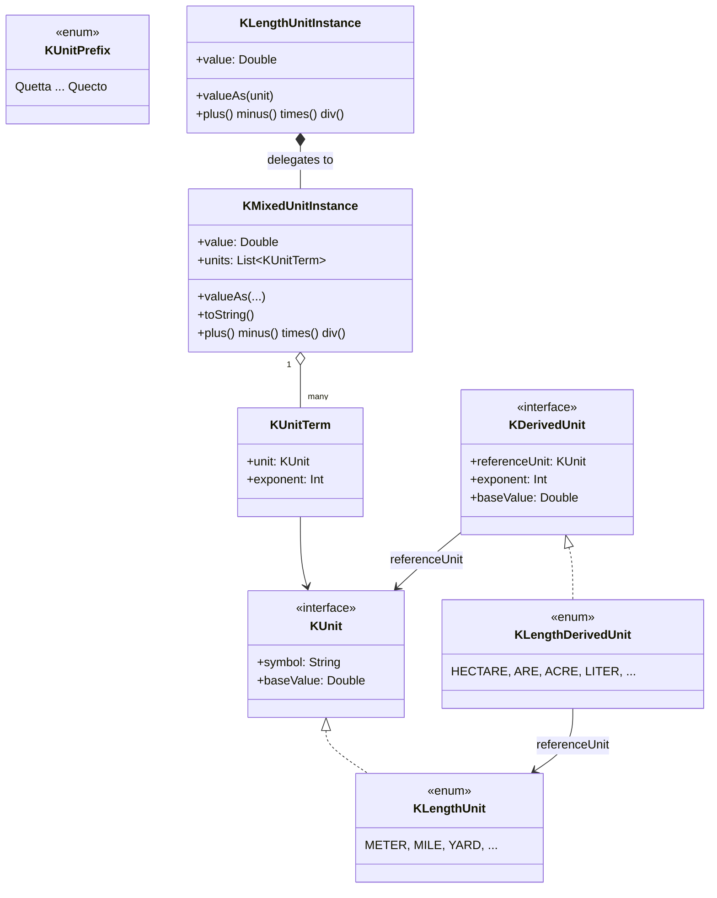

<p align="center">
  
</p>

# kunit

> 🌐 [English](README.md) · [한국어](README.ko.md) · [中文](README.zh.md) · **日本語**
>
> 完全なドキュメントは [GitHub Pages](https://kleinerhacker.github.io/kunit/) でも 4 言語で提供されています
> ([EN](https://kleinerhacker.github.io/kunit/) ·
> [KO](https://kleinerhacker.github.io/kunit/ko/) ·
> [ZH](https://kleinerhacker.github.io/kunit/zh/) ·
> [JA](https://kleinerhacker.github.io/kunit/ja/))。

Kotlin（および Java）向けの単位計算フレームワークです。単なる数値ではなく、実際の物理単位を
`Double` 精度で計算できます。

## チェックアウト & ビルド

```bash
git clone <repository-url>
cd kunit
```

本プロジェクトは Gradle を使用します（ラッパーがリポジトリに含まれているため、ローカルへの Gradle
インストールは不要です）：

```bash
# ビルド
./gradlew build          # Windows: gradlew.bat build

# テストのみ実行
./gradlew test            # Windows: gradlew.bat test
```

toolchain 25 を解決できる JDK が必要です（`foojay-resolver` プラグインが必要に応じて自動的に
ダウンロードします）。

## ドキュメントサイト

📖 **[GitHub Pages でドキュメントを読む](https://kleinerhacker.github.io/kunit/)**

完全なドキュメント（概要、クイックスタート、混合単位、カスタム単位の追加、定義済み単位）は
[MkDocs Material](https://squidfunk.github.io/mkdocs-material/) で構築されており、
[mkdocs-static-i18n](https://github.com/ultrabug/mkdocs-static-i18n) を通じて英語、韓国語、
中国語、日本語で提供され、ライト/ダークモードの切り替えに対応しています。

```bash
pip install -r docs/requirements.txt

# ライブリロードでローカル配信
mkdocs serve

# 静的サイトを ./site にビルド
mkdocs build
```

## アーキテクチャ

* **`KMixedUnitInstance`** —— *混合単位*を表します：正規化された `Double` の基準値と、それぞれ指数
  （正 = 分子、負 = 分母）と結び付いた `KUnit` の集合からなり、互いに掛け合わされているとみなされます。
* **`KUnit`** —— 単一の「純粋」単位（記号 + 所属グループの基準単位への換算係数）のためのインターフェイス
  です。単位グループごとに `enum class ... : KUnit`（例：`KLengthUnit`）として実装されます。
* **ラッパークラス**（例：`KLengthUnitInstance`）—— 具体的なグループのために `KMixedUnitInstance` を委譲で
  カプセル化し、値を常にそのグループの基準単位に正規化して保持します。指数 1 に限定されず、同じグループの
  導出量（例：面積 = 長さ²、体積 = 長さ³）もカバーします。
* **`KUnitPrefix`** —— 完全な SI 接頭辞表（Quetta/Q ～ Quecto/q）を持つルートパッケージのジェネリック
  列挙型です。接頭辞は `KUnit` 自体の一部ではなく、値の読み書き時にのみ意味を持ち、
  グループごとの `infix` 関数（例：`5 kilo meters`）で組み合わせ、そのグループの具体単位を直接返します
  （`5 kilo meters` は `KLengthUnitInstance`、`5000.meters` と同等）。
* **特殊単位**（`KDerivedUnit` / `KScaledDerivedUnit`）—— 独自の名前/記号を持ち、グループと指数に
  紐付いた追加の換算先（例：面積のヘクタール、体積のリットル）で、基本メカニズムを置き換えるのではなく
  補完します。



### パッケージ構造

* ルートパッケージ `org.pcsoft.framework.kunit` には基本型 `KUnit`、`KMixedUnitInstance`、`KUnitPrefix`、
  `KDerivedUnit`、… が含まれます。各単位サブパッケージは独自の接頭辞 `infix` 関数（例：
  `KLengthUnitPrefix.kt`）を追加で宣言します。
* すべての「純粋」単位グループは独自のサブパッケージ（例：`org.pcsoft.framework.kunit.length`）を持ち、
  それぞれ独自の `KXxxUnit`、`KXxxUnitInstance`、`KXxxDerivedUnit` と関連する生成拡張関数を含みます。

### 演算子

* `+`、`-`、`*`、`/` は純粋単位、混合単位、およびその両方の組み合わせに対応しています。
* `==`、`!=`、`<`、`<=`、`>`、`>=` は純粋単位に対応しています。混合単位はさらに純粋単位/指数の確認用
  メソッド（`hasSameUnits`）を提供します。
* `+`/`-` は、同じ単位グループかつ同じ指数（純粋単位）の場合、または指数を含めて完全に同一の `KUnit`
  （混合単位）の場合にのみ許可されます —— そうでない場合は `IllegalStateException` がスローされます。

## このフレームワークが現在サポートするもの

現在の実装状況（詳細は [STATUS.md](STATUS.md) を参照）：

### ルートエンジン

* 完全な演算子と `toString` 換算を備えた `KMixedUnitInstance`/`KUnitTerm` 混合単位エンジン
* `KUnitPrefix` による完全な SI 接頭辞表（24 個の値、Quetta/Q ～ Quecto/q）
* 具体単位を直接返すグループごとの接頭辞の構築（`5 kilo meters`）
* 特殊/導出単位のためのジェネリックなメカニズム（`KScaledUnit`、`KDerivedUnit`、`KScaledDerivedUnit`）

### 単位グループ

| グループ | サブパッケージ | 基準単位 |
|---|---|---|
| 長さ | `org.pcsoft.framework.kunit.length` | メートル (`KLengthUnit.BASE`) |

#### 長さ (`KLengthUnit`)

メートル、マイル、海里、ヤード、フィート、インチ、ファゾム、チェーン、ハロン、天文単位、光年、パーセク。

#### 多次元サポート（指数 > 1）

`KLengthUnitInstance` は `KLengthUnit.BASE` の任意の指数をカプセル化し、次を含みます：

* **指数 2（面積）** —— 特殊単位を含む（`KLengthDerivedUnit`）：アール、ヘクタール、エーカー
* **指数 3（体積）** —— 特殊単位を含む（`KLengthDerivedUnit`）：リットル、米ガロン、英ガロン、
  米液量オンス、石油バレル

### 未対応

* `length` パターンに従うさらなる単位グループ（例：質量、時間、温度）
* それ自体が混合単位で構成される複合「純粋」単位（例：ニュートン）

## クイックスタート

必要な単位グループを依存関係として追加（またはプロジェクト/ソースセットとして含め）、使用する単位グループの
ボキャブラリを import してください。

### 長さ

```kotlin
import org.pcsoft.framework.kunit.KUnitPrefix
import org.pcsoft.framework.kunit.with
import org.pcsoft.framework.kunit.length.*

// 任意の Number 型から純粋な長さの値を生成
val distance = 5.meters
val trip = 10.miles

// 演算子：同じグループと指数の範囲内で自動換算
val total = distance + trip          // KLengthUnitInstance、メートルに正規化
val diff = trip - distance

// 比較
val isFarther = trip > distance      // true

// 特定の単位で値を読み取る
println(total.valueAs(KUnitPrefix.KILO with meters)) // 例：21.0467...
println(total.valueAs(yards))         // 例：23018.4...

// 純粋単位の乗算/除算は混合単位（KMixedUnitInstance）を構築します
val area = distance.toKMixedUnitInstance() * trip.toKMixedUnitInstance()

// 面積（指数 2）と体積（指数 3）のための特殊単位
val plot = 3.hectares
println(plot.valueAs(KLengthDerivedUnit.ARE))   // 300.0

val tank = 200.liters
println(tank.valueAs(KLengthDerivedUnit.US_GALLON))
```

### SI 接頭辞

```kotlin
import org.pcsoft.framework.kunit.length.kilo
import org.pcsoft.framework.kunit.length.meters

// "5 kilo meters" -> KLengthUnitInstance (direct, == 5000.meters)
val fiveKm = 5 kilo meters
println(fiveKm.value) // 5000.0（メートルに正規化）
```

### 混合単位

```kotlin
import org.pcsoft.framework.kunit.KMixedUnitInstance
import org.pcsoft.framework.kunit.KUnitTerm
import org.pcsoft.framework.kunit.length.KLengthUnit

// 混合単位を手動で構成、例：メートル毎秒（時間グループが存在すれば length^1 * time^-1）
val speed = KMixedUnitInstance(10.0, listOf(KUnitTerm(KLengthUnit.METER, 1)))
val doubled = speed * speed // 指数が加算される -> length^2
```
