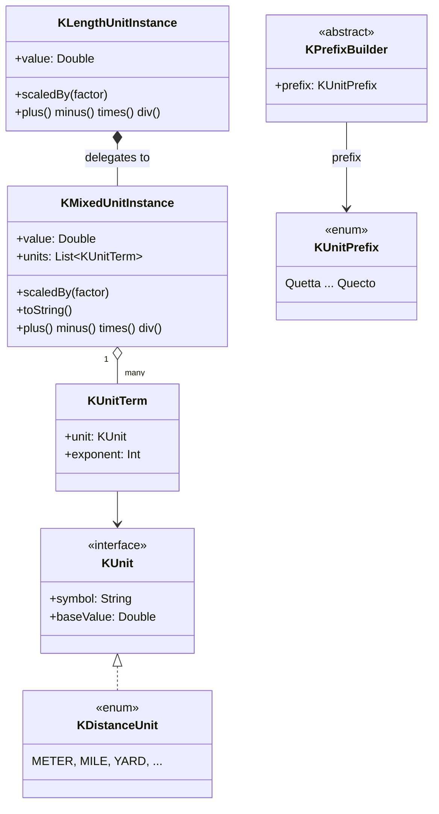

<p align="center">
  
</p>

# kunit

> 🌐 [English](README.md) · [한국어](README.ko.md) · [中文](README.zh.md) · **日本語**
>
> 完全なドキュメントは [GitHub Pages](https://kleinerhacker.github.io/kunit/) でも4つの言語で提供されています
> ([EN](https://kleinerhacker.github.io/kunit/) ·
> [KO](https://kleinerhacker.github.io/kunit/ko/) ·
> [ZH](https://kleinerhacker.github.io/kunit/zh/) ·
> [JA](https://kleinerhacker.github.io/kunit/ja/))。

Kotlin(および Java)で異なる単位を使って計算するための Kotlin 単位フレームワーク — 素の数値の代わりに、実際の
物理単位を `Double` 精度で計算します。

## チェックアウトとビルド

```bash
git clone <repository-url>
cd kunit
```

このプロジェクトは Gradle を使用します(ラッパーはリポジトリに含まれており、ローカルの Gradle インストールは
不要です):

```bash
# ビルド
./gradlew build          # Windows: gradlew.bat build

# テストのみ実行
./gradlew test            # Windows: gradlew.bat test
```

ツールチェーン 25 を解決できる JDK が必要です(必要に応じて `foojay-resolver` プラグインが自動的に
ダウンロードします)。

## ドキュメントサイト

📖 **[GitHub Pages でドキュメントを読む](https://kleinerhacker.github.io/kunit/)**

完全なドキュメント(概要、クイックスタート、混合単位、カスタム単位の追加、事前定義された単位)は
[MkDocs Material](https://squidfunk.github.io/mkdocs-material/) で構築され、
[mkdocs-static-i18n](https://github.com/ultrabug/mkdocs-static-i18n) を介して英語、韓国語、中国語、日本語で
提供され、ライト/ダークモードの切り替えを備えています。

```bash
pip install -r docs/requirements.txt

# ライブリロード付きでローカル配信
mkdocs serve

# 静的サイトを ./site にビルド
mkdocs build
```

## アーキテクチャ

* **`KMixedUnitInstance`** — *混合単位*を表します: 正規化された `Double` の基底値と、それぞれが指数(正 = 分子、
  負 = 分母)と結合され、互いに掛け合わされると見なされる `KUnit` の集合。
* **`KUnit`** — 単一の「純粋な」単位のインターフェース(記号 + そのグループの基本単位への変換係数)。単位グループ
  ごとに `enum class ... : KUnit`(例: `KDistanceUnit`)として実装されます。
* **ラッパークラス**(例: `KLengthUnitInstance`) — 具体的なグループのために委譲を介して `KMixedUnitInstance` を
  カプセル化し、常にそのグループの基本単位に正規化された値を保ちます。指数1に限定されず、同じグループの派生量
  (例: 面積 = 長さ²、体積 = 長さ³)も扱います。
* **`of` / `into`** — 単位のための2つの動詞。`number of <値1単位テンプレート>`(`10.5 of kilo.meters`)で
  作成し、`value into <単位>`(`v into kilo.meters`、`Double` を返す)で読み取ります。
* **`KUnitPrefix` と接頭辞ビルダー** — 完全な SI 接頭辞表(Quetta/Q から Quecto/q まで)が**ビルダー値**
  (`kilo`、`milli` など)として公開され、プロパティアクセスを介して bare トークンを値1テンプレートに変えます
  (`kilo.meters`、`milli.seconds`)。コンパイル時の階層
  (`KPrefixBuilder`/`KDiminishingPrefixBuilder`/`KAugmentingPrefixBuilder`)が、どの単位がどの接頭辞を
  受け付けるかを強制します(`milli.bytes` はコンパイルされません)。
* **特殊単位** — 名前付きの値1インスタンス(例: 面積の `hectares`、体積の `liters`)で、他のトークンと同じように
  `of`/`into` で使用します。



### パッケージ構造

* ルートパッケージ `org.pcsoft.framework.kunit` は基底型 `KUnit`、`KMixedUnitInstance`、
  `KUnitMeasurable`(`of`/`into`/`scaledBy` を含む)、`KUnitPrefix` および `KPrefixBuilder` 階層を含みます。
* すべての「純粋な」単位グループは独自のサブパッケージ(例: `org.pcsoft.framework.kunit.distance`)を持ち、独自の
  `KXxxUnit`、`KXxxUnitInstance`、その値1 bare トークン(`K*UnitBareValues.kt`)および接頭辞ビルダーの
  プロパティ拡張(`K*UnitExtensions.kt`)を持ちます。

### 演算子

* `+`、`-`、`*`、`/` は純粋な単位、混合単位、および両方の混在に対してサポートされます。
* `==`、`!=`、`<`、`<=`、`>`、`>=` は純粋な単位に対してサポートされます。混合単位はさらに、純粋な単位/指数の
  チェックのためのメソッド(`hasSameUnits`)を提供します。
* `+`/`-` は、同じ単位グループ内で同じ指数(純粋な単位)である場合、または指数を含めてまったく同じ `KUnit`
  (混合単位)である場合にのみ許可されます — そうでなければ `IllegalStateException` がスローされます。

## フレームワークは現在何をサポートしていますか?

現在の実装状況(詳細は [STATUS.md](STATUS.md) を参照):

### ルートエンジン

* 完全な演算子と基本単位 `toString` を備えた `KMixedUnitInstance`/`KUnitTerm` 混合単位エンジン
* `of` / `into` の作成 & 読み取り動詞(`Number.of`、`KUnitMeasurable.into`、`scaledBy`)
* 接頭辞**ビルダー**(`kilo`、`milli` など)として公開された完全な SI 接頭辞表(24値)、および2進 IEC ビルダー
  (`kibi` など);`KPrefixBuilder` 階層が単位ごとの接頭辞ポリシーをコンパイル時に強制
* 名前付きの値1インスタンスとしての特殊/派生単位(`hectares`、`liters` など)

### 単位グループ

| グループ | サブパッケージ | 基本単位 |
|---|---|---|
| 距離 | `org.pcsoft.framework.kunit.distance` | メートル (`KDistanceUnit.BASE`) |
| 時間 | `org.pcsoft.framework.kunit.time` | 秒 (`KTimeUnit.BASE`) |
| ストレージ | `org.pcsoft.framework.kunit.storage` | バイト (`KStorageUnit.BASE`) |
| 速度 (構成: 長さ·時間⁻¹) | `org.pcsoft.framework.kunit.speed` | メートル毎秒 (`KSpeedUnit.BASE`) |
| データ転送率 (構成: ストレージ·時間⁻¹) | `org.pcsoft.framework.kunit.datarate` | バイト毎秒 (`KDataRateUnit.BASE`) |

#### 距離 (`KDistanceUnit`)

メートル、マイル、海里、ヤード、フィート、インチ、ファゾム、チェーン、ファーロング、天文単位、光秒 … 光年、
パーセク。

#### 次元付きサブタイプ(型としての指数)

距離グループは、開いた基底 `KDistanceUnitInstance`(任意の指数)の下で、指数をそれぞれ独立したコンパイル時安全な
型としてモデル化します:

* **`KLengthUnitInstance`** — 指数1(長さ): `5 of meters`、`3 of kilo.meters`
* **`KAreaUnitInstance`** — 指数2(面積): `(2 of meters) pow 2`、`(2 of kilo.meters) pow 2`、および名前付き
  特殊単位 `ares`、`hectares`、`acres`
* **`KVolumeUnitInstance`** — 指数3(体積): `(2 of meters) pow 3`、および `liters`、`usGallons`、
  `imperialGallons`、`usFluidOunces`、`oilBarrels`

`*`/`/` は可能な限りこのファミリー内に留まります(`length * length = area`、`area / length = length`);結果の
指数が `{1,2,3}` の外に出ると `KDistanceUnitInstance` にフォールバックします。次元をまたぐ `+`/`-`/比較
(`length + area`)は実行時失敗ではなく**コンパイルエラー**です。

infix `pow` で単位をべき乗します(Kotlin にはオーバーロード可能な `^` がありません): `(2 of meters) pow 2` は
`(2 m)² = 4 m²`、`(2 of meters) pow 3` は体積で、`pow` はすべてのグループで動作します(`(2 of hours) pow 2`)。
これが唯一のべき乗構文です — `squareXxx`/`cubicXxx` コンストラクタは存在しません。

#### 構成されたグループ(2つの中核グループから合成)

* **速度** (`KSpeedUnit`) — `length · time⁻¹`;`(100 of meters) / (10 of seconds)` や
  `10 of kilo.meters / hours`(`KSpeedUnitInstance`)で直接構築し、`speed * time` / `length / speed` で中核
  単位を復元します。
* **データ転送率** (`KDataRateUnit`) — `storage · time⁻¹`;`(100 of bytes) / (10 of seconds)` や
  `5 of mega.bytes / seconds`(`KDataRateUnitInstance`)で構築し、`rate * time` / `storage / rate` で中核単位を
  復元します。式としてのみ構築され(`bytesPerSecond` トークンなし)、2進の分子は `kibi.bytes / seconds` で。

### 未対応

* `length` パターンに従う追加の単位グループ(例: 質量、温度)
* それ自体が混合単位で構成される複合「純粋な」単位(例: ニュートン)

## クイックスタート

モジュールを依存関係として追加し(またはプロジェクト/ソースセットとして含め)、必要な単位グループの語彙を
インポートします。

### 距離

```kotlin
import org.pcsoft.framework.kunit.of
import org.pcsoft.framework.kunit.into
import org.pcsoft.framework.kunit.kilo
import org.pcsoft.framework.kunit.distance.*

// 値1テンプレートに `of` で純粋な長さの値を作成
val distance = 5 of meters           // KLengthUnitInstance(指数1)
val trip = 10 of miles

// 演算子: 同じグループと指数の中での自動変換
val total = distance + trip          // KLengthUnitInstance、メートルに正規化
val diff = trip - distance

// distance + ((3 of meters) pow 2)   // コンパイルされない: 長さ + 面積はコンパイルエラー

// 比較
val isFarther = trip > distance      // true

// `into` で特定の単位の値を読み取る
println(total into kilo.meters)      // 例: 21.0467...
println(total into yards)            // 例: 23018.4...

// 2つの長さを掛けると強く型付けされた面積になり、面積 / 長さは再び長さになる
val area = (200 of meters) * (50 of meters)  // KAreaUnitInstance(10 000 m²)
val side = area / (100 of meters)            // KLengthUnitInstance(100 m)

// `pow` によるべき乗、および名前付きの面積/体積単位
val hall = (3 of meters) pow 2       // KAreaUnitInstance(9 m²)
val bigPlot = (2 of kilo.meters) pow 2 // KAreaUnitInstance(4 000 000 m²)
val box = (2 of meters) pow 3        // KVolumeUnitInstance(8 m³)
val plot = 3 of hectares             // KAreaUnitInstance
println(plot into ares)              // 300.0
val tank = 200 of liters             // KVolumeUnitInstance
println(tank into usGallons)
```

### SI 接頭辞

```kotlin
import org.pcsoft.framework.kunit.of
import org.pcsoft.framework.kunit.kilo
import org.pcsoft.framework.kunit.distance.meters

// `5 of kilo.meters` -> KLengthUnitInstance(== 5000 m)
val fiveKm = 5 of kilo.meters
println(fiveKm.value) // 5000.0(メートルに正規化)
```

### 複合 / 混合単位

```kotlin
import org.pcsoft.framework.kunit.of
import org.pcsoft.framework.kunit.pow
import org.pcsoft.framework.kunit.distance.meters
import org.pcsoft.framework.kunit.milli
import org.pcsoft.framework.kunit.time.seconds

// 値1テンプレートから単位式を組み立て、`of` でスケールする
val accel = 10 of meters / (seconds pow 2)   // KMixedUnitInstance, m·s⁻²
val speed = 10 of kilo.meters / milli.seconds // KSpeedUnitInstance(括弧なし)
```
