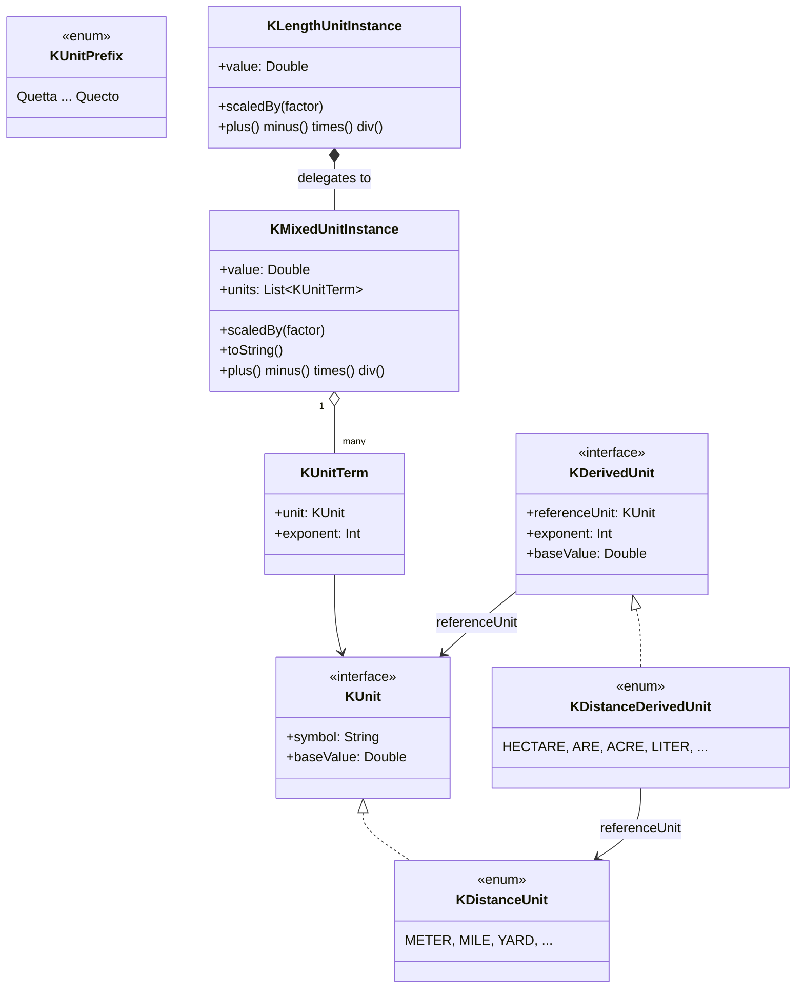

<p align="center">
  
</p>

# kunit

> 🌐 [English](README.md) · **한국어** · [中文](README.zh.md) · [日本語](README.ja.md)
>
> 전체 문서는 [GitHub Pages](https://kleinerhacker.github.io/kunit/)에서 네 가지 언어로도 제공됩니다
> ([EN](https://kleinerhacker.github.io/kunit/) ·
> [KO](https://kleinerhacker.github.io/kunit/ko/) ·
> [ZH](https://kleinerhacker.github.io/kunit/zh/) ·
> [JA](https://kleinerhacker.github.io/kunit/ja/)).

맨 숫자 대신 실제 물리 단위를 `Double` 정밀도로 계산할 수 있게 해 주는, Kotlin(및 Java)용 단위 프레임워크입니다.

## 체크아웃 및 빌드

```bash
git clone <repository-url>
cd kunit
```

이 프로젝트는 Gradle을 사용합니다(래퍼가 저장소에 포함되어 있어 로컬 Gradle 설치가 필요 없습니다):

```bash
# 빌드
./gradlew build          # Windows: gradlew.bat build

# 테스트만 실행
./gradlew test            # Windows: gradlew.bat test
```

툴체인 25를 해결할 수 있는 JDK가 필요합니다(필요한 경우 `foojay-resolver` 플러그인이 자동으로 다운로드합니다).

## 문서 사이트

📖 **[GitHub Pages에서 문서 읽기](https://kleinerhacker.github.io/kunit/)**

전체 문서(개요, 빠른 시작, 혼합 단위, 사용자 정의 단위 추가, 사전 정의된 단위)는
[MkDocs Material](https://squidfunk.github.io/mkdocs-material/)로 빌드되며,
[mkdocs-static-i18n](https://github.com/ultrabug/mkdocs-static-i18n)을 통해 영어, 한국어, 중국어, 일본어로
제공되고 라이트/다크 모드 토글을 갖추고 있습니다.

```bash
pip install -r docs/requirements.txt

# 라이브 리로드로 로컬 서빙
mkdocs serve

# 정적 사이트를 ./site 로 빌드
mkdocs build
```

## 아키텍처

* **`KMixedUnitInstance`** — *혼합 단위*를 나타냅니다: 정규화된 `Double` 기본 값과, 각각 지수(양수 = 분자,
  음수 = 분모)와 결합되어 서로 곱해지는 것으로 간주되는 `KUnit`들의 집합.
* **`KUnit`** — 단일 "순수" 단위를 위한 인터페이스(기호 + 그 그룹의 기본 단위로의 변환 계수). 단위 그룹별로
  `enum class ... : KUnit`(예: `KDistanceUnit`)로 구현됩니다.
* **래퍼 클래스**(예: `KLengthUnitInstance`) — 구체적인 그룹을 위해 위임을 통해 `KMixedUnitInstance`를
  캡슐화하고 항상 그 그룹의 기본 단위로 정규화된 값을 유지합니다. 지수 1에 국한되지 않고, 같은 그룹의 파생량
  (예: 면적 = 길이², 부피 = 길이³)도 다룹니다.
* **`of` / `into`** — 단위를 위한 두 개의 동사. `number of <값 1 단위 템플릿>`(`10.5 of kilo.meters`)으로
  만들고, `value into <단위>`(`v into kilo.meters`, `Double` 반환)로 읽습니다.
* **`KUnitPrefix` & 접두사 빌더** — 완전한 SI 접두사 표(Quetta/Q부터 Quecto/q까지)가 **빌더 값**(`kilo`,
  `milli` 등)으로 노출되어, 프로퍼티 접근을 통해 맨 토큰을 값 1 템플릿으로 바꿉니다(`kilo.meters`,
  `milli.seconds`). 컴파일 타임 계층(`KPrefixBuilder`/`KDiminishingPrefixBuilder`/`KAugmentingPrefixBuilder`)이
  어떤 단위가 어떤 접두사를 받아들이는지 강제합니다(`milli.bytes`는 컴파일되지 않음).
* **특수 단위** — 명명된 값 1 인스턴스(예: 면적의 `hectares`, 부피의 `liters`)로, 다른 토큰과 마찬가지로
  `of`/`into`와 함께 사용됩니다.



### 패키지 구조

* 루트 패키지 `org.pcsoft.framework.kunit`은 기본 타입 `KUnit`, `KMixedUnitInstance`,
  `KUnitMeasurable`(`of`/`into`/`scaledBy` 포함), `KUnitPrefix` 및 `KPrefixBuilder` 계층을 담고 있습니다.
* 모든 "순수" 단위 그룹은 자체 서브 패키지(예: `org.pcsoft.framework.kunit.distance`)를 가지며, 자체 `KXxxUnit`,
  `KXxxUnitInstance`, 값 1 맨 토큰(`K*UnitBareValues.kt`) 및 접두사 빌더 프로퍼티 확장(`K*UnitExtensions.kt`)을
  포함합니다.

### 연산자

* `+`, `-`, `*`, `/`는 순수 단위, 혼합 단위, 그리고 둘을 섞는 경우에 지원됩니다.
* `==`, `!=`, `<`, `<=`, `>`, `>=`는 순수 단위에 지원됩니다. 혼합 단위는 추가로 순수 단위/지수 검사를 위한
  메서드(`hasSameUnits`)를 제공합니다.
* `+`/`-`는 같은 단위 그룹 내에서 같은 지수(순수 단위)일 때만, 또는 지수를 포함해 정확히 같은 `KUnit`들
  (혼합 단위)일 때만 허용됩니다 — 그렇지 않으면 `IllegalStateException`이 던져집니다.

## 프레임워크는 현재 무엇을 지원하나요?

현재 구현 상태(자세한 내용은 [STATUS.md](STATUS.md) 참조):

### 루트 엔진

* 완전한 연산자와 기본 단위 `toString`을 갖춘 `KMixedUnitInstance`/`KUnitTerm` 혼합 단위 엔진
* `of` / `into` 생성 & 읽기 동사(`Number.of`, `KUnitMeasurable.into`, `scaledBy`)
* 접두사 **빌더**(`kilo`, `milli` 등)로 노출된 완전한 SI 접두사 표(24개 값), 그리고 이진 IEC 빌더(`kibi` 등);
  `KPrefixBuilder` 계층이 단위별 접두사 정책을 컴파일 타임에 강제
* 명명된 값 1 인스턴스로서의 특수/파생 단위(`hectares`, `liters` 등)

### 단위 그룹

| 그룹 | 서브 패키지 | 기본 단위 |
|---|---|---|
| 거리 | `org.pcsoft.framework.kunit.distance` | 미터 (`KDistanceUnit.BASE`) |
| 시간 | `org.pcsoft.framework.kunit.time` | 초 (`KTimeUnit.BASE`) |
| 저장 용량 | `org.pcsoft.framework.kunit.storage` | 바이트 (`KStorageUnit.BASE`) |
| 속도 (구성됨: 길이·시간⁻¹) | `org.pcsoft.framework.kunit.speed` | 초당 미터 (`KSpeedUnit.BASE`) |
| 데이터 전송률 (구성됨: 저장 용량·시간⁻¹) | `org.pcsoft.framework.kunit.datarate` | 초당 바이트 (`KDataRateUnit.BASE`) |

#### 거리 (`KDistanceUnit`)

미터, 마일, 해리, 야드, 피트, 인치, 패덤, 체인, 펄롱, 천문단위, 광초 … 광년, 파섹.

#### 차원이 있는 서브타입(타입으로서의 지수)

거리 그룹은 열린 기반 `KDistanceUnitInstance`(임의의 지수) 아래에서 지수를 컴파일 타임에 안전한 고유 타입으로
모델링합니다:

* **`KLengthUnitInstance`** — 지수 1 (길이): `5 of meters`, `3 of kilo.meters`
* **`KAreaUnitInstance`** — 지수 2 (면적): `(2 of meters) pow 2`, `(2 of kilo.meters) pow 2`, 그리고 명명된
  특수 단위 `ares`, `hectares`, `acres`
* **`KVolumeUnitInstance`** — 지수 3 (부피): `(2 of meters) pow 3`, 그리고 `liters`, `usGallons`,
  `imperialGallons`, `usFluidOunces`, `oilBarrels`

`*`/`/`는 가능한 한 이 패밀리 안에 머뭅니다(`length * length = area`, `area / length = length`); 결과 지수가
`{1,2,3}` 밖이면 `KDistanceUnitInstance`로 폴백합니다. 차원을 넘나드는 `+`/`-`/비교(`length + area`)는 런타임
실패가 아니라 **컴파일 오류**입니다.

infix `pow`로 단위를 거듭제곱합니다(Kotlin에는 오버로드 가능한 `^`가 없음): `(2 of meters) pow 2`는
`(2 m)² = 4 m²`, `(2 of meters) pow 3`은 부피이며, `pow`는 모든 그룹에서 동작합니다(`(2 of hours) pow 2`). 이것이
유일한 거듭제곱 구문입니다 — `squareXxx`/`cubicXxx` 생성자는 없습니다.

#### 구성된 그룹(두 핵심 그룹으로 합성됨)

* **속도** (`KSpeedUnit`) — `length · time⁻¹`; `(100 of meters) / (10 of seconds)`나
  `10 of kilo.meters / hours`(`KSpeedUnitInstance`)로 직접 만들고, `speed * time` / `length / speed`로 핵심
  단위를 복구합니다.
* **데이터 전송률** (`KDataRateUnit`) — `storage · time⁻¹`; `(100 of bytes) / (10 of seconds)`나
  `5 of mega.bytes / seconds`(`KDataRateUnitInstance`)로 만들고, `rate * time` / `storage / rate`로 핵심 단위를
  복구합니다. 표현식으로만 만들며(`bytesPerSecond` 토큰 없음), 이진 분자는 `kibi.bytes / seconds`로.

### 아직 미해결

* `length` 패턴을 따르는 추가 단위 그룹(예: 질량, 온도)
* 그 자체가 혼합 단위로 구성된 복합 "순수" 단위(예: 뉴턴)

## 빠른 시작

모듈을 의존성으로 추가하고(또는 프로젝트/소스 세트로 포함하고) 필요한 단위 그룹의 어휘를 가져옵니다.

### 거리

```kotlin
import org.pcsoft.framework.kunit.of
import org.pcsoft.framework.kunit.into
import org.pcsoft.framework.kunit.kilo
import org.pcsoft.framework.kunit.distance.*

// 값 1 템플릿에 `of`로 순수한 길이 값을 만들기
val distance = 5 of meters           // KLengthUnitInstance(지수 1)
val trip = 10 of miles

// 연산자: 같은 그룹과 지수 내에서의 자동 변환
val total = distance + trip          // KLengthUnitInstance, 미터로 정규화
val diff = trip - distance

// distance + ((3 of meters) pow 2)   // 컴파일되지 않음: 길이 + 면적은 컴파일 오류

// 비교
val isFarther = trip > distance      // true

// `into`로 특정 단위의 값을 읽기
println(total into kilo.meters)      // 예: 21.0467...
println(total into yards)            // 예: 23018.4...

// 두 길이를 곱하면 강하게 타입이 지정된 면적이 되고, 면적 / 길이는 다시 길이가 됨
val area = (200 of meters) * (50 of meters)  // KAreaUnitInstance(10 000 m²)
val side = area / (100 of meters)            // KLengthUnitInstance(100 m)

// `pow`를 통한 거듭제곱, 그리고 명명된 면적/부피 단위
val hall = (3 of meters) pow 2       // KAreaUnitInstance(9 m²)
val bigPlot = (2 of kilo.meters) pow 2 // KAreaUnitInstance(4 000 000 m²)
val box = (2 of meters) pow 3        // KVolumeUnitInstance(8 m³)
val plot = 3 of hectares             // KAreaUnitInstance
println(plot into ares)              // 300.0
val tank = 200 of liters             // KVolumeUnitInstance
println(tank into usGallons)
```

### SI 접두사

```kotlin
import org.pcsoft.framework.kunit.of
import org.pcsoft.framework.kunit.kilo
import org.pcsoft.framework.kunit.distance.meters

// `5 of kilo.meters` -> KLengthUnitInstance(== 5000 m)
val fiveKm = 5 of kilo.meters
println(fiveKm.value) // 5000.0(미터로 정규화)
```

### 복합 / 혼합 단위

```kotlin
import org.pcsoft.framework.kunit.of
import org.pcsoft.framework.kunit.pow
import org.pcsoft.framework.kunit.distance.meters
import org.pcsoft.framework.kunit.milli
import org.pcsoft.framework.kunit.time.seconds

// 값 1 템플릿에서 단위 표현식을 조합하고 `of`로 스케일링
val accel = 10 of meters / (seconds pow 2)   // KMixedUnitInstance, m·s⁻²
val speed = 10 of kilo.meters / milli.seconds // KSpeedUnitInstance(괄호 없이)
```
