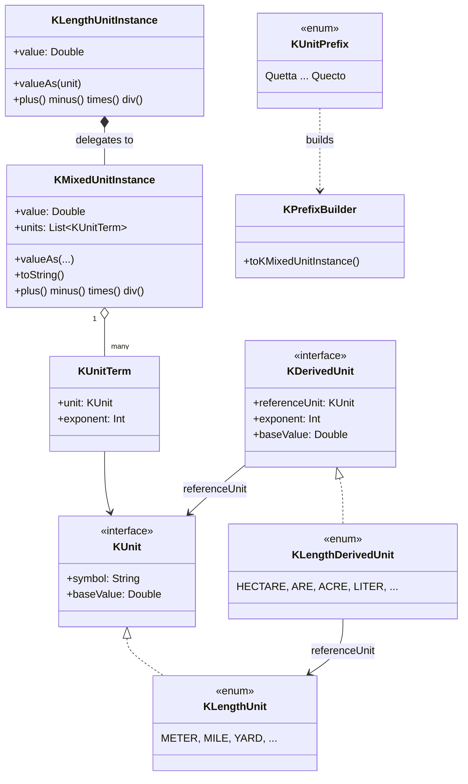

<p align="center">
  
</p>

# kunit

> 🌐 **English** · [한국어](README.ko.md) · [中文](README.zh.md) · [日本語](README.ja.md)
>
> The full documentation is also available in all four languages on
> [GitHub Pages](https://kleinerhacker.github.io/kunit/)
> ([EN](https://kleinerhacker.github.io/kunit/) ·
> [KO](https://kleinerhacker.github.io/kunit/ko/) ·
> [ZH](https://kleinerhacker.github.io/kunit/zh/) ·
> [JA](https://kleinerhacker.github.io/kunit/ja/)).

Kotlin Unit Framework to calculate with different units in Kotlin (and Java) - calculate with real physical
units in `Double` precision instead of bare numbers.

## Checkout & Build

```bash
git clone <repository-url>
cd kunit
```

The project uses Gradle (the wrapper is included in the repository, no local Gradle installation needed):

```bash
# Build
./gradlew build          # Windows: gradlew.bat build

# Run tests only
./gradlew test            # Windows: gradlew.bat test
```

A JDK capable of resolving toolchain 25 is required (the `foojay-resolver` plugin downloads it automatically
if needed).

## Documentation Site

📖 **[Read the documentation on GitHub Pages](https://kleinerhacker.github.io/kunit/)**

The full documentation (overview, quick start, mixed units, adding custom units, predefined units) is built
with [MkDocs Material](https://squidfunk.github.io/mkdocs-material/) and available in English, Korean,
Chinese and Japanese via [mkdocs-static-i18n](https://github.com/ultrabug/mkdocs-static-i18n), with a
light/dark mode toggle.

```bash
pip install -r docs/requirements.txt

# Serve locally with live-reload
mkdocs serve

# Build the static site into ./site
mkdocs build
```

## Architecture

* **`KMixedUnitInstance`** - represents a *mixed unit*: a normalized `Double` base value plus a set of `KUnit`s,
  each combined with an exponent (positive = numerator, negative = denominator) that are thought of as
  multiplied together.
* **`KUnit`** - interface for a single "pure" unit (symbol + conversion factor to the base unit of its group).
  Implemented per unit group as `enum class ... : KUnit` (e.g. `KLengthUnit`).
* **Wrapper classes** (e.g. `KLengthUnitInstance`) - encapsulate a `KMixedUnitInstance` via delegation for a
  concrete group and always keep their value normalized to that group's base unit. They are not limited to
  exponent 1 - they also cover derived quantities of the same group (e.g. area = length², volume = length³).
* **`KUnitPrefix`** - generic root-package enum with the complete SI prefix table (Quetta/Q to Quecto/q).
  Prefixes are not part of `KUnit` itself, they only matter for reading/writing values, and are combined via
  generic `infix` functions (e.g. `5 kilo meters`) followed by `KPrefixBuilder.toKMixedUnitInstance()`.
* **Special units** (`KDerivedUnit` / `KScaledDerivedUnit`) - additional, group- and exponent-bound conversion
  targets with their own name/symbol (e.g. hectare for area, liter for volume), complementing rather than
  replacing the normal mechanism.



### Package Structure

* Root package `org.pcsoft.framework.kunit` contains the base types `KUnit`, `KMixedUnitInstance`, `KUnitPrefix`,
  `KDerivedUnit`, `KPrefixBuilder`, ...
* Every "pure" unit group gets its own sub-package (e.g. `org.pcsoft.framework.kunit.length`) with its own
  `KXxxUnit`, `KXxxUnitInstance`, `KXxxDerivedUnit` and the associated creator extensions.

### Operators

* `+`, `-`, `*`, `/` are supported for pure units, mixed units and mixing both.
* `==`, `!=`, `<`, `<=`, `>`, `>=` are supported for pure units; mixed units additionally offer a method for
  pure unit/exponent checking (`hasSameUnits`).
* `+`/`-` are only allowed within the same unit group and with the same exponent (pure units), or with exactly
  the same `KUnit`s including exponents (mixed units) - otherwise an `IllegalStateException` is thrown.

## What does the framework currently support?

Current implementation status (see [STATUS.md](STATUS.md) for details):

### Root Engine

* `KMixedUnitInstance`/`KUnitTerm` mixed-unit engine with full operators and `toString` conversion
* Complete SI prefix table (24 values, Quetta/Q to Quecto/q) via `KUnitPrefix`
* Generic, group-independent prefix construction (`5 kilo meters`)
* Generic mechanism for special/derived units (`KScaledUnit`, `KDerivedUnit`, `KScaledDerivedUnit`)

### Unit Groups

| Group | Sub-package | Base unit |
|---|---|---|
| Length | `org.pcsoft.framework.kunit.length` | Meter (`KLengthUnit.BASE`) |

#### Length (`KLengthUnit`)

Meter, mile, nautical mile, yard, foot, inch, fathom, chain, furlong, astronomical unit, light-year, parsec.

#### Multi-dimensional support (exponent > 1)

`KLengthUnitInstance` encapsulates arbitrary exponents of `KLengthUnit.BASE`, including:

* **Exponent 2 (area)** - incl. special units (`KLengthDerivedUnit`): are, hectare, acre
* **Exponent 3 (volume)** - incl. special units (`KLengthDerivedUnit`): liter, US gallon, imperial gallon,
  US fluid ounce, oil barrel

### Still Open

* Further unit groups following the `length` pattern (e.g. mass, time, temperature)
* Composite "pure" units that are themselves composed of a mixed unit (e.g. Newton)

## Quick Start

Add the module as a dependency (or include it as a project/source set) and import the vocabulary of the unit
group you need.

### Length

```kotlin
import org.pcsoft.framework.kunit.KUnitPrefix
import org.pcsoft.framework.kunit.with
import org.pcsoft.framework.kunit.length.*

// Create pure length values from any Number type
val distance = 5.meters()
val trip = 10.miles()

// Operators: automatic conversion within the same group and exponent
val total = distance + trip          // KLengthUnitInstance, normalized to meters
val diff = trip - distance

// Comparisons
val isFarther = trip > distance      // true

// Read the value in a specific unit
println(total.valueAs(KUnitPrefix.KILO with meters)) // e.g. 21.0467...
println(total.valueAs(yards))         // e.g. 23018.4...

// Multiplying/dividing pure units builds a mixed unit (KMixedUnitInstance)
val area = distance.toKMixedUnitInstance() * trip.toKMixedUnitInstance()

// Special units for area (exponent 2) and volume (exponent 3)
val plot = 3.hectares()
println(plot.valueAs(KLengthDerivedUnit.ARE))   // 300.0

val tank = 200.liters()
println(tank.valueAs(KLengthDerivedUnit.US_GALLON))
```

### SI prefixes

```kotlin
import org.pcsoft.framework.kunit.kilo
import org.pcsoft.framework.kunit.length.meters
import org.pcsoft.framework.kunit.length.toKLengthUnit

// "5 kilo meters" -> KPrefixBuilder -> KMixedUnitInstance -> KLengthUnitInstance
val fiveKm = (5 kilo meters).toKMixedUnitInstance().toKLengthUnit()
println(fiveKm.value) // 5000.0 (normalized to meters)
```

### Mixed units

```kotlin
import org.pcsoft.framework.kunit.KMixedUnitInstance
import org.pcsoft.framework.kunit.KUnitTerm
import org.pcsoft.framework.kunit.length.KLengthUnit

// Manually composing a mixed unit, e.g. meters per second (length^1 * time^-1 once a time group exists)
val speed = KMixedUnitInstance(10.0, listOf(KUnitTerm(KLengthUnit.METER, 1)))
val doubled = speed * speed // exponents are added -> length^2
```
