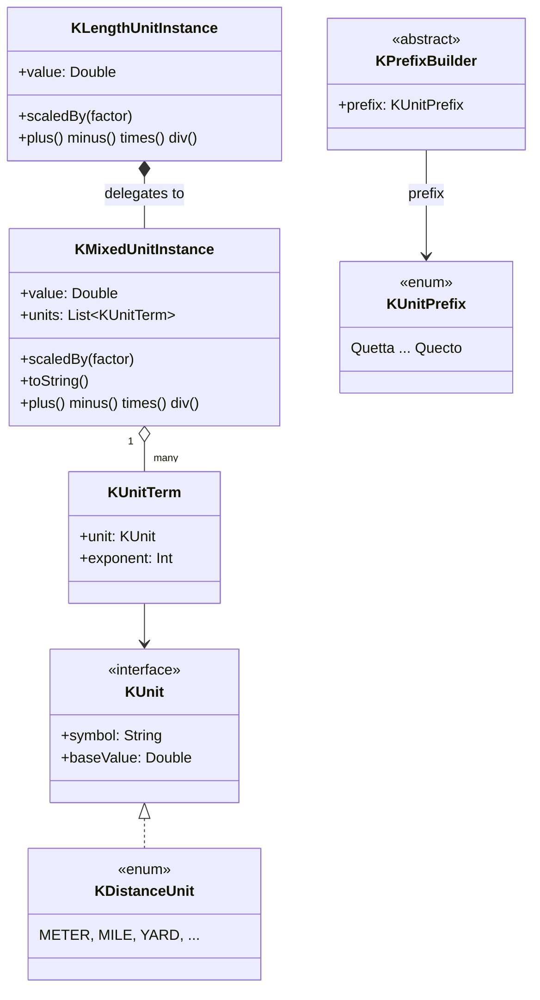

<p align="center">
  
</p>

# kunit

> 🌐 **English** · [한국어](README.ko.md) · [中文](README.zh.md) · [日本語](README.ja.md)
>
> The full documentation is also available in all four languages on
> [GitHub Pages](https://kleinerhacker.github.io/kunit/)
> ([EN](https://kleinerhacker.github.io/kunit/) ·
> [KO](https://kleinerhacker.github.io/kunit/ko/) ·
> [ZH](https://kleinerhacker.github.io/kunit/zh/) ·
> [JA](https://kleinerhacker.github.io/kunit/ja/)).

Kotlin Unit Framework to calculate with different units in Kotlin (and Java) - calculate with real physical
units in `Double` precision instead of bare numbers.

## Checkout & Build

```bash
git clone <repository-url>
cd kunit
```

The project uses Gradle (the wrapper is included in the repository, no local Gradle installation needed):

```bash
# Build
./gradlew build          # Windows: gradlew.bat build

# Run tests only
./gradlew test            # Windows: gradlew.bat test
```

A JDK capable of resolving toolchain 25 is required (the `foojay-resolver` plugin downloads it automatically
if needed).

## Documentation Site

📖 **[Read the documentation on GitHub Pages](https://kleinerhacker.github.io/kunit/)**

The full documentation (overview, quick start, mixed units, adding custom units, predefined units) is built
with [MkDocs Material](https://squidfunk.github.io/mkdocs-material/) and available in English, Korean,
Chinese and Japanese via [mkdocs-static-i18n](https://github.com/ultrabug/mkdocs-static-i18n), with a
light/dark mode toggle.

```bash
pip install -r docs/requirements.txt

# Serve locally with live-reload
mkdocs serve

# Build the static site into ./site
mkdocs build
```

## Architecture

* **`KMixedUnitInstance`** - represents a *mixed unit*: a normalized `Double` base value plus a set of `KUnit`s,
  each combined with an exponent (positive = numerator, negative = denominator) that are thought of as
  multiplied together.
* **`KUnit`** - interface for a single "pure" unit (symbol + conversion factor to the base unit of its group).
  Implemented per unit group as `enum class ... : KUnit` (e.g. `KDistanceUnit`).
* **Wrapper classes** (e.g. `KLengthUnitInstance`) - encapsulate a `KMixedUnitInstance` via delegation for a
  concrete group and always keep their value normalized to that group's base unit. They are not limited to
  exponent 1 - they also cover derived quantities of the same group (e.g. area = length², volume = length³).
* **`of` / `into`** - the two verbs for units. Build with `number of <value-1 unit template>`
  (`10.5 of kilo.meters`), read with `value into <unit>` (`v into kilo.meters`, returns `Double`).
* **`KUnitPrefix` & prefix builders** - the complete SI prefix table (Quetta/Q to Quecto/q) is exposed as
  **builder values** (`kilo`, `milli`, …) that turn a bare token into a value-1 template via property
  access (`kilo.meters`, `milli.seconds`). A compile-time hierarchy
  (`KPrefixBuilder`/`KDiminishingPrefixBuilder`/`KAugmentingPrefixBuilder`) enforces which units accept
  which prefixes (`milli.bytes` does not compile).
* **Special units** - named value-1 instances (e.g. `hectares` for area, `liters` for volume), used with
  `of`/`into` just like any other token.



### Package Structure

* Root package `org.pcsoft.framework.kunit` contains the base types `KUnit`, `KMixedUnitInstance`,
  `KUnitMeasurable` (with `of`/`into`/`scaledBy`), `KUnitPrefix` and the `KPrefixBuilder` hierarchy.
* Every "pure" unit group gets its own sub-package (e.g. `org.pcsoft.framework.kunit.distance`) with its own
  `KXxxUnit`, `KXxxUnitInstance`, its value-1 bare tokens (`K*UnitBareValues.kt`) and its prefix-builder
  property extensions (`K*UnitExtensions.kt`).

### Operators

* `+`, `-`, `*`, `/` are supported for pure units, mixed units and mixing both.
* `==`, `!=`, `<`, `<=`, `>`, `>=` are supported for pure units; mixed units additionally offer a method for
  pure unit/exponent checking (`hasSameUnits`).
* `+`/`-` are only allowed within the same unit group and with the same exponent (pure units), or with exactly
  the same `KUnit`s including exponents (mixed units) - otherwise an `IllegalStateException` is thrown.

## What does the framework currently support?

Current implementation status (see [STATUS.md](STATUS.md) for details):

### Root Engine

* `KMixedUnitInstance`/`KUnitTerm` mixed-unit engine with full operators and base-unit `toString`
* `of` / `into` construction & reading verbs (`Number.of`, `KUnitMeasurable.into`, `scaledBy`)
* Complete SI prefix table (24 values) exposed as prefix **builders** (`kilo`, `milli`, …), plus the
  binary IEC builders (`kibi`, …); the `KPrefixBuilder` hierarchy enforces per-unit prefix policy at
  compile time
* Special/derived units as named value-1 instances (`hectares`, `liters`, …)

### Unit Groups

| Group | Sub-package | Base unit |
|---|---|---|
| Distance | `org.pcsoft.framework.kunit.distance` | Meter (`KDistanceUnit.BASE`) |
| Time | `org.pcsoft.framework.kunit.time` | Second (`KTimeUnit.BASE`) |
| Storage | `org.pcsoft.framework.kunit.storage` | Byte (`KStorageUnit.BASE`) |
| Speed (constructed: length·time⁻¹) | `org.pcsoft.framework.kunit.speed` | Meter per second (`KSpeedUnit.BASE`) |
| Data Rate (constructed: storage·time⁻¹) | `org.pcsoft.framework.kunit.datarate` | Byte per second (`KDataRateUnit.BASE`) |

#### Distance (`KDistanceUnit`)

Meter, mile, nautical mile, yard, foot, inch, fathom, chain, furlong, astronomical unit, light-second …
light-year, parsec.

#### Dimensioned subtypes (exponent as a type)

The distance group models exponents as their own compile-time-safe types under an open base
`KDistanceUnitInstance` (any exponent):

* **`KLengthUnitInstance`** - exponent 1 (a length): `5 of meters`, `3 of kilo.meters`
* **`KAreaUnitInstance`** - exponent 2 (an area): `(2 of meters) pow 2`, `(2 of kilo.meters) pow 2`, plus
  the named special units `ares`, `hectares`, `acres`
* **`KVolumeUnitInstance`** - exponent 3 (a volume): `(2 of meters) pow 3`, plus `liters`,
  `usGallons`, `imperialGallons`, `usFluidOunces`, `oilBarrels`

`*`/`/` stay in this family where possible (`length * length = area`, `area / length = length`); a
resulting exponent outside `{1,2,3}` falls back to `KDistanceUnitInstance`. Cross-dimension `+`/`-`/
comparison (`length + area`) are a **compile error**, not a runtime failure.

Raise a unit to a power with the infix `pow` (Kotlin has no overloadable `^`): `(2 of meters) pow 2` is
`(2 m)² = 4 m²`, `(2 of meters) pow 3` a volume, and `pow` works on every group (`(2 of hours) pow 2`).
It is the only power syntax — there are no `squareXxx`/`cubicXxx` constructors.

#### Constructed groups (composed of two core groups)

* **Speed** (`KSpeedUnit`) - `length · time⁻¹`; build it directly with `(100 of meters) / (10 of seconds)`
  or `10 of kilo.meters / hours` (a `KSpeedUnitInstance`), recover the core units with `speed * time` /
  `length / speed`.
* **Data Rate** (`KDataRateUnit`) - `storage · time⁻¹`; build it with `(100 of bytes) / (10 of seconds)`
  or `5 of mega.bytes / seconds` (a `KDataRateUnitInstance`), recover the core units with `rate * time` /
  `storage / rate`. Built only as an expression (no `bytesPerSecond` token); binary numerator via
  `kibi.bytes / seconds`.

### Still Open

* Further unit groups following the `length` pattern (e.g. mass, temperature)
* Composite "pure" units that are themselves composed of a mixed unit (e.g. Newton)

## Quick Start

Add the module as a dependency (or include it as a project/source set) and import the vocabulary of the unit
group you need.

### Distance

```kotlin
import org.pcsoft.framework.kunit.of
import org.pcsoft.framework.kunit.into
import org.pcsoft.framework.kunit.kilo
import org.pcsoft.framework.kunit.distance.*

// Build pure length values with `of` on a value-1 template
val distance = 5 of meters           // KLengthUnitInstance (exponent 1)
val trip = 10 of miles

// Operators: automatic conversion within the same group and exponent
val total = distance + trip          // KLengthUnitInstance, normalized to meters
val diff = trip - distance

// distance + ((3 of meters) pow 2)   // does NOT compile: length + area is a compile error

// Comparisons
val isFarther = trip > distance      // true

// Read the value in a specific unit with `into`
println(total into kilo.meters)      // e.g. 21.0467...
println(total into yards)            // e.g. 23018.4...

// Multiplying two lengths yields a strongly typed area; area / length yields a length again
val area = (200 of meters) * (50 of meters)  // KAreaUnitInstance (10 000 m²)
val side = area / (100 of meters)            // KLengthUnitInstance (100 m)

// Powers via `pow`, plus the named area/volume units
val hall = (3 of meters) pow 2       // KAreaUnitInstance (9 m²)
val bigPlot = (2 of kilo.meters) pow 2 // KAreaUnitInstance (4 000 000 m²)
val box = (2 of meters) pow 3        // KVolumeUnitInstance (8 m³)
val plot = 3 of hectares             // KAreaUnitInstance
println(plot into ares)              // 300.0
val tank = 200 of liters             // KVolumeUnitInstance
println(tank into usGallons)
```

### SI prefixes

```kotlin
import org.pcsoft.framework.kunit.of
import org.pcsoft.framework.kunit.kilo
import org.pcsoft.framework.kunit.distance.meters

// `5 of kilo.meters` -> KLengthUnitInstance (== 5000 m)
val fiveKm = 5 of kilo.meters
println(fiveKm.value) // 5000.0 (normalized to meters)
```

### Composite / mixed units

```kotlin
import org.pcsoft.framework.kunit.of
import org.pcsoft.framework.kunit.pow
import org.pcsoft.framework.kunit.distance.meters
import org.pcsoft.framework.kunit.milli
import org.pcsoft.framework.kunit.time.seconds

// Compose a unit expression from value-1 templates and scale it with `of`
val accel = 10 of meters / (seconds pow 2)   // KMixedUnitInstance, m·s⁻²
val speed = 10 of kilo.meters / milli.seconds // KSpeedUnitInstance (klammerfrei)
```
