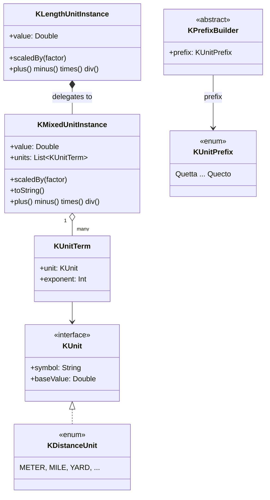

<p align="center">
  
</p>

# kunit

> 🌐 The full documentation is available in six languages on
> [GitHub Pages](https://kleinerhacker.github.io/kunit/)
> ([EN](https://kleinerhacker.github.io/kunit/) ·
> [KO](https://kleinerhacker.github.io/kunit/ko/) ·
> [ZH](https://kleinerhacker.github.io/kunit/zh/) ·
> [JA](https://kleinerhacker.github.io/kunit/ja/) ·
> [AR](https://kleinerhacker.github.io/kunit/ar/) ·
> [HI](https://kleinerhacker.github.io/kunit/hi/)).

Kotlin Unit Framework to calculate with different units in Kotlin (and Java) - calculate with real physical
units in `Double` precision instead of bare numbers.

## Checkout & Build

```bash
git clone <repository-url>
cd kunit
```

The project uses Gradle (the wrapper is included in the repository, no local Gradle installation needed):

```bash
# Build
./gradlew build          # Windows: gradlew.bat build

# Run tests only
./gradlew test            # Windows: gradlew.bat test
```

A JDK capable of resolving toolchain 25 is required (the `foojay-resolver` plugin downloads it automatically
if needed).

## Documentation Site

📖 **[Read the documentation on GitHub Pages](https://kleinerhacker.github.io/kunit/)**

The full documentation (overview, quick start, mixed units, adding custom units, and the unit pages
grouped by subject area — kinematics, mechanics, electrical engineering, thermodynamics, information
technology, each with its own overview) is built with
[MkDocs Material](https://squidfunk.github.io/mkdocs-material/) and available in English, Korean, Chinese,
Japanese, Arabic and Hindi via [mkdocs-static-i18n](https://github.com/ultrabug/mkdocs-static-i18n),
with a light/dark mode toggle.

```bash
pip install -r docs/requirements.txt

# Serve locally with live-reload
mkdocs serve

# Build the static site into ./site
mkdocs build
```

## Architecture

* **`KMixedUnitInstance`** - represents a *mixed unit*: a normalized `Double` base value plus a set of `KUnit`s,
  each combined with an exponent (positive = numerator, negative = denominator) that are thought of as
  multiplied together.
* **`KUnit`** - interface for a single "pure" unit (symbol + conversion factor to the base unit of its group).
  Implemented per unit group as `enum class ... : KUnit` (e.g. `KDistanceUnit`).
* **Wrapper classes** (e.g. `KLengthUnitInstance`) - encapsulate a `KMixedUnitInstance` via delegation for a
  concrete group and always keep their value normalized to that group's base unit. They are not limited to
  exponent 1 - they also cover derived quantities of the same group (e.g. area = length², volume = length³).
* **`of` / `into` / `format`** - the verbs for units. Build with `number of <value-1 unit template>`
  (`10.5 of kilo.meters`), read with `value into <unit>` (`v into kilo.meters`, returns `Double`), and
  render value **and** unit symbol with `value format <unit>` (`v format kilo.meters / hours` → `"… km/h"`;
  a `format(target, pattern, locale, formatter)` overload adds number formatting and a pluggable
  `KUnitFormatter` for custom notations like LaTeX). The library ships `KDefaultUnitFormatter` (plain
  text) and `KConsoleUnitFormatter` (ANSI-coloured console output, with a selectable `KConsoleColorPalette`
  – `CLASSIC`, `VIVID`, `MONOCHROME`, or your own).
* **`KUnitPrefix` & prefix builders** - the complete SI prefix table (Quetta/Q to Quecto/q) is exposed as
  **builder values** (`kilo`, `milli`, …) that turn a bare token into a value-1 template via property
  access (`kilo.meters`, `milli.seconds`). A compile-time hierarchy
  (`KPrefixBuilder`/`KDiminishingPrefixBuilder`/`KAugmentingPrefixBuilder`) enforces which units accept
  which prefixes (`milli.bytes` does not compile).
* **Special units** - named value-1 instances (e.g. `hectares` for area, `liters` for volume), used with
  `of`/`into` just like any other token.



### Package Structure

* Root package `org.pcsoft.framework.kunit` contains the base types `KUnit`, `KMixedUnitInstance`,
  `KUnitMeasurable` (with `of`/`into`/`scaledBy`), `KUnitPrefix` and the `KPrefixBuilder` hierarchy.
* Every "pure" unit group gets its own sub-package (e.g. `org.pcsoft.framework.kunit.distance`) with its own
  `KXxxUnit`, `KXxxUnitInstance`, its value-1 bare tokens (`K*UnitBareValues.kt`) and its prefix-builder
  property extensions (`K*UnitExtensions.kt`).

### Operators

* `+`, `-`, `*`, `/` are supported for pure units, mixed units and mixing both.
* `==`, `!=`, `<`, `<=`, `>`, `>=` are supported for pure units; mixed units additionally offer a method for
  pure unit/exponent checking (`hasSameUnits`).
* `+`/`-` are only allowed within the same unit group and with the same exponent (pure units), or with exactly
  the same `KUnit`s including exponents (mixed units) - otherwise an `IllegalStateException` is thrown.
* Units can also be scaled by a plain `Number`: `unit * n`, `n * unit` and `unit / n` keep the same typed
  unit, while `n / unit` inverts the dimension to a mixed unit (e.g. `1 / (2 of seconds)` = s⁻¹). This makes
  formula-style code read naturally, e.g. a circle area `Math.PI * (r * r)` stays a typed area. Scalar `+`/`-`
  is not supported, and the affine absolute temperature rejects scalar `*`/`/` at compile time (scale a
  temperature *difference* instead).

```kotlin
val r = 12 of centi.meters       // KLengthUnitInstance, 0.12 m
val area = Math.PI * (r * r)     // KAreaUnitInstance: π·r² ≈ 0.04524 m²
```

## What does the framework currently support?

Current implementation status (see [STATUS.md](STATUS.md) for details):

### Root Engine

* `KMixedUnitInstance`/`KUnitTerm` mixed-unit engine with full operators and base-unit `toString`
* `of` / `into` / `format` construction, reading & rendering verbs (`Number.of`, `KUnitMeasurable.into`,
  `KUnitMeasurable.format`, `scaledBy`), with a pluggable `KUnitFormatter`/`KDefaultUnitFormatter`
* Complete SI prefix table (24 values) exposed as prefix **builders** (`kilo`, `milli`, …), plus the
  binary IEC builders (`kibi`, …); the `KPrefixBuilder` hierarchy enforces per-unit prefix policy at
  compile time
* Special/derived units as named value-1 instances (`hectares`, `liters`, …)

### Unit Groups

| Group | Sub-package | Base unit |
|---|---|---|
| Distance | `org.pcsoft.framework.kunit.distance` | Meter (`KDistanceUnit.BASE`) |
| Time | `org.pcsoft.framework.kunit.time` | Second (`KTimeUnit.BASE`) |
| Frequency (inverse of time) | `org.pcsoft.framework.kunit.frequency` | Hertz (`KFrequencyUnit.BASE`) |
| Mass | `org.pcsoft.framework.kunit.mass` | Gram (`KMassUnit.BASE`) |
| Electric Current | `org.pcsoft.framework.kunit.ec` | Ampere (`KElectricCurrentUnit.BASE`) |
| Storage | `org.pcsoft.framework.kunit.storage` | Byte (`KStorageUnit.BASE`) |
| Temperature | `org.pcsoft.framework.kunit.temperature` | Kelvin (`KTemperatureUnit.BASE`) |
| Temperature Difference | `org.pcsoft.framework.kunit.temperature` | Kelvin (`KTemperatureDifferenceUnit.BASE`) |
| Speed (constructed: length·time⁻¹) | `org.pcsoft.framework.kunit.speed` | Meter per second (`KSpeedUnit.BASE`) |
| Data Rate (constructed: storage·time⁻¹) | `org.pcsoft.framework.kunit.datarate` | Byte per second (`KDataRateUnit.BASE`) |
| Acceleration (constructed: length·time⁻²) | `org.pcsoft.framework.kunit.acceleration` | Meter per second squared (`KAccelerationUnit.BASE`) |
| Force (constructed: mass·length·time⁻²) | `org.pcsoft.framework.kunit.force` | Newton (`KForceUnit.BASE`) |
| Pressure (constructed: mass·length⁻¹·time⁻²) | `org.pcsoft.framework.kunit.pressure` | Pascal (`KPressureUnit.BASE`) |
| Density (constructed: mass·length⁻³) | `org.pcsoft.framework.kunit.density` | Kilogram per cubic meter (`KDensityUnit.BASE`) |
| Area Density (constructed: mass·length⁻²) | `org.pcsoft.framework.kunit.areadensity` | Kilogram per square meter (`KAreaDensityUnit.BASE`) |
| Voltage (constructed: mass·length²·time⁻³·current⁻¹) | `org.pcsoft.framework.kunit.voltage` | Volt (`KVoltageUnit.BASE`) |
| Resistance (constructed: mass·length²·time⁻³·current⁻²) | `org.pcsoft.framework.kunit.resistance` | Ohm (`KResistanceUnit.BASE`) |

#### Distance (`KDistanceUnit`)

Meter, mile, nautical mile, yard, foot, inch, fathom, chain, furlong, astronomical unit, light-second …
light-year, parsec, plus historical units: cubit, Roman foot (pes), Roman pace (passus), stadium,
Roman mile (mille passus), rod (perch), league, cable length, verst, Prussian mile.

#### Dimensioned subtypes (exponent as a type)

The distance group models exponents as their own compile-time-safe types under an open base
`KDistanceUnitInstance` (any exponent):

* **`KLengthUnitInstance`** - exponent 1 (a length): `5 of meters`, `3 of kilo.meters`
* **`KAreaUnitInstance`** - exponent 2 (an area): `(2 of meters) pow 2`, `(2 of kilo.meters) pow 2`, plus
  the named special units `ares`, `hectares`, `acres`, `roods`, `squarePerches`, `morgens`, `jochs`,
  `tagwerks`
* **`KVolumeUnitInstance`** - exponent 3 (a volume): `(2 of meters) pow 3`, plus `liters`,
  `usGallons`, `imperialGallons`, `usFluidOunces`, `oilBarrels`, `imperialBushels`, `hogsheads`,
  `imperialPints`, `imperialQuarts`

`*`/`/` stay in this family where possible (`length * length = area`, `area / length = length`); a
resulting exponent outside `{1,2,3}` falls back to `KDistanceUnitInstance`. Cross-dimension `+`/`-`/
comparison (`length + area`) are a **compile error**, not a runtime failure.

Raise a unit to a power with the infix `pow` (Kotlin has no overloadable `^`): `(2 of meters) pow 2` is
`(2 m)² = 4 m²`, `(2 of meters) pow 3` a volume, and `pow` works on every group (`(2 of hours) pow 2`).
It is the only power syntax — there are no `squareXxx`/`cubicXxx` constructors.

#### Mass (`KMassUnit`)

Gram (base), tonne, metric carat, and the avoirdupois (grain, dram, ounce, pound, stone, US/UK
hundredweight, short/long ton, slug), troy (pennyweight, troy ounce, troy pound), historical/regional
(German pound, Zentner, Lot, jin/catty, liang/tael, momme, kan) and scientific (dalton/u) units. The base
unit is the **gram**, not the kilogram — the kilogram is simply `kilo.grams`. Every unit takes the full
SI prefix set; `+`/`-`/comparison and `equals` work on the normalized gram value.

```kotlin
val m = 2 of kilo.grams          // 2000 g (the kilogram is `kilo.grams`)
m into pounds                    // ≈ 4.409
(1 of kilo.grams) == (1000 of grams) // true
```

#### Electric Current (`KElectricCurrentUnit`)

Ampere (base) plus the two classic CGS current units: the biot / abampere (`Bi`/`abA`, EMU, tokens
`biot`/`abamperes`, `1 Bi = 10 A`) and the statampere (`statA`, ESU, token `statamperes`,
`1 statA ≈ 3.335 641 × 10⁻¹⁰ A`). Electric current is a plain native group with **no** cross-unit typed
results; every unit takes the full SI prefix set (`milli.amperes` = mA, `kilo.amperes` = kA), and
`+`/`-`/comparison and `equals` work on the normalized ampere value.

```kotlin
val i = 2 of milli.amperes           // 0.002 A
(1 of biot) into amperes             // 10.0
(1 of biot) == (10 of amperes)       // true
```

#### Frequency (`KFrequencyUnit`)

Hertz (base), revolutions per second (`rps`), frames per second (`fps`), revolutions per minute (`rpm`,
1/60 Hz) and beats per minute (`bpm`, 1/60 Hz). Frequency is a native group and the **inverse of time**
(`1 Hz = 1/s`); every unit takes the full SI prefix set (`kilo.hertz` = kHz, `mega.hertz` = MHz). Its
cross-group operators are exactly inverse to time — multiplying by a frequency behaves like dividing by a
time: `count / time = frequency`, `frequency * time = count`, `length * frequency = speed`,
`speed / frequency = distance`. `KMixedUnitInstance.toFrequency()` converts a single frequency term back
to the pure wrapper.

```kotlin
val f = 60 / (1 of seconds)          // KFrequencyUnitInstance, 60 Hz
(3000 of rpm) into hertz             // 50.0
val v = (2 of meters) * (5 of hertz) // KSpeedUnitInstance, 10 m/s
```

#### Temperature (`KTemperatureUnit`)

Kelvin (base), Celsius, Fahrenheit, Rankine. Temperature is the framework's **first (permanent) affine
exception**: conversions are offset-and-scale (`°C = K − 273.15`), not a single factor. The shared engine
stays multiplicative — the affine transform is injected through the `scaledBy` (behind `of`) and
`readBaseValue` (behind `into`) hooks, so `25 of celsius` and `t into fahrenheit` use the normal verbs
with no shadow-prone overloads. Values are stored as absolute kelvin (so `*`/`/`/`pow` run unchanged),
and the group has **no prefixes**.

```kotlin
(0 of celsius) into kelvin       // 273.15
(100 of celsius) into fahrenheit // 212.0
(32 of fahrenheit) into celsius  // 0.0
(0 of celsius) into rankine      // 491.67
```

An absolute temperature is an affine **point**, not a vector, so its arithmetic is deliberately
asymmetric: subtracting two absolute temperatures yields a **`KTemperatureDifferenceUnitInstance`** (the
kelvin interval), while `AbsTemp + AbsTemp` is a **compile error**.

#### Temperature Difference (`KTemperatureDifferenceUnit`)

The **linear** counterpart to the affine temperature group (kelvin only, no prefixes): a temperature
*interval*, not an absolute point. It is produced by `AbsTemp − AbsTemp` or explicitly via
`KTemperatureDifference.ofKelvin(…)`, and can be added to / subtracted from an absolute temperature to
yield an absolute temperature again. Its symbol is rendered as **`ΔK`** (not `K`) so that a difference is
visually distinguishable from an absolute kelvin — in a mixed unit `m·K` (absolute) and `m·ΔK`
(difference) are the same dimension but **not** the same unit (neither equal nor addable).

```kotlin
val d = (30 of celsius) - (10 of celsius)             // KTemperatureDifferenceUnitInstance: 20 ΔK
d.value                                                // 20.0  (not -253.15 °C!)
d.toString()                                           // "20.0 ΔK"  (ΔK, distinct from absolute K)
(25 of celsius) + KTemperatureDifference.ofKelvin(5)   // 303.15 K (absolute)
```

#### Constructed groups (composed of two core groups)

* **Speed** (`KSpeedUnit`) - `length · time⁻¹`; build it directly with `(100 of meters) / (10 of seconds)`
  or `10 of kilo.meters / hours` (a `KSpeedUnitInstance`), recover the core units with `speed * time` /
  `length / speed`.
* **Data Rate** (`KDataRateUnit`) - `storage · time⁻¹`; build it with `(100 of bytes) / (10 of seconds)`
  or `5 of mega.bytes / seconds` (a `KDataRateUnitInstance`), recover the core units with `rate * time` /
  `storage / rate`. Built only as an expression (no `bytesPerSecond` token); binary numerator via
  `kibi.bytes / seconds`.
* **Acceleration** (`KAccelerationUnit`) - `length · time⁻²`; named tokens `gals`, `standardGravities`
  (both prefixable); build via `speed / time`, recover with `acceleration * time` / `speed / acceleration`.
* **Force** (`KForceUnit`) - `mass · length · time⁻²`; tokens `newtons`, `dynes`, `poundsForce`, `ponds`
  (kgf = `kilo.ponds`); build via `mass * acceleration`, recover with `force / mass` / `force / acceleration`.
* **Pressure** (`KPressureUnit`) - `mass · length⁻¹ · time⁻²`; tokens `pascals`, `bars`, `atmospheres`,
  `psis`, `torrs` (N/mm² = `mega.pascals`); build via `force / area`, recover with `pressure * area` /
  `force / pressure`.
* **Density** (`KDensityUnit`) - `mass · length⁻³`; no bare token, built as `kilo.grams / (meters pow 3)`
  or via `mass / volume`, recover with `density * volume` / `mass / density`.
* **Area Density** (`KAreaDensityUnit`) - `mass · length⁻²` (surface load, statics); built as
  `kilo.grams / (meters pow 2)` or via `mass / area`; density bridge `density * length` / `area density / length`.
* **Voltage** (`KVoltageUnit`) - `mass · length² · time⁻³ · current⁻¹`; tokens `volts`, `statvolts`,
  `abvolts`, `westonCells`, `daniells`. **Multiple decompositions**: typed `resistance * current` (Ohm's
  law) or the native `kg·m²·s⁻³·A⁻¹` expression narrowed with `toVoltage()` - both value-equal.
* **Resistance** (`KResistanceUnit`) - `mass · length² · time⁻³ · current⁻²`; tokens `ohms`, `statohms`,
  `abohms`, `internationalOhms`, `legalOhms`, `siemensUnits`. **Multiple decompositions**: typed
  `voltage / current` (Ohm's law) or the native `kg·m²·s⁻³·A⁻²` expression narrowed with `toResistance()`;
  inverse operators `resistance * current` / `voltage / resistance` - all value-equal.

### Still Open

* Further unit groups following the `length` pattern
* Further composite "pure" units composed of a mixed unit

## Quick Start

Add the module as a dependency (or include it as a project/source set) and import the vocabulary of the unit
group you need.

### Distance

```kotlin
import org.pcsoft.framework.kunit.of
import org.pcsoft.framework.kunit.into
import org.pcsoft.framework.kunit.kilo
import org.pcsoft.framework.kunit.distance.*

// Build pure length values with `of` on a value-1 template
val distance = 5 of meters           // KLengthUnitInstance (exponent 1)
val trip = 10 of miles

// Operators: automatic conversion within the same group and exponent
val total = distance + trip          // KLengthUnitInstance, normalized to meters
val diff = trip - distance

// distance + ((3 of meters) pow 2)   // does NOT compile: length + area is a compile error

// Comparisons
val isFarther = trip > distance      // true

// Read the value in a specific unit with `into`
println(total into kilo.meters)      // e.g. 21.0467...
println(total into yards)            // e.g. 23018.4...

// Multiplying two lengths yields a strongly typed area; area / length yields a length again
val area = (200 of meters) * (50 of meters)  // KAreaUnitInstance (10 000 m²)
val side = area / (100 of meters)            // KLengthUnitInstance (100 m)

// Powers via `pow`, plus the named area/volume units
val hall = (3 of meters) pow 2       // KAreaUnitInstance (9 m²)
val bigPlot = (2 of kilo.meters) pow 2 // KAreaUnitInstance (4 000 000 m²)
val box = (2 of meters) pow 3        // KVolumeUnitInstance (8 m³)
val plot = 3 of hectares             // KAreaUnitInstance
println(plot into ares)              // 300.0
val tank = 200 of liters             // KVolumeUnitInstance
println(tank into usGallons)
```

### SI prefixes

```kotlin
import org.pcsoft.framework.kunit.of
import org.pcsoft.framework.kunit.kilo
import org.pcsoft.framework.kunit.distance.meters

// `5 of kilo.meters` -> KLengthUnitInstance (== 5000 m)
val fiveKm = 5 of kilo.meters
println(fiveKm.value) // 5000.0 (normalized to meters)
```

### Composite / mixed units

```kotlin
import org.pcsoft.framework.kunit.of
import org.pcsoft.framework.kunit.pow
import org.pcsoft.framework.kunit.distance.meters
import org.pcsoft.framework.kunit.milli
import org.pcsoft.framework.kunit.time.seconds

// Compose a unit expression from value-1 templates and scale it with `of`
val accel = 10 of meters / (seconds pow 2)   // KMixedUnitInstance, m·s⁻²
val speed = 10 of kilo.meters / milli.seconds // KSpeedUnitInstance (klammerfrei)
```
