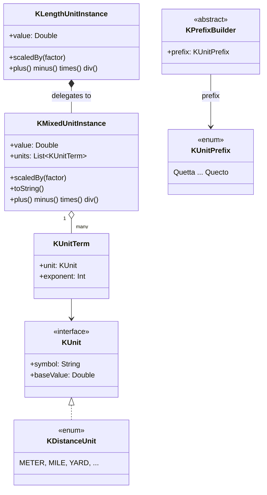

<p align="center">
  
</p>

# kunit

> 🌐 The full documentation is available in six languages on
> [GitHub Pages](https://kleinerhacker.github.io/kunit/)
> ([EN](https://kleinerhacker.github.io/kunit/) ·
> [KO](https://kleinerhacker.github.io/kunit/ko/) ·
> [ZH](https://kleinerhacker.github.io/kunit/zh/) ·
> [JA](https://kleinerhacker.github.io/kunit/ja/) ·
> [AR](https://kleinerhacker.github.io/kunit/ar/) ·
> [HI](https://kleinerhacker.github.io/kunit/hi/)).

Kotlin Unit Framework to calculate with different units in Kotlin (and Java) - calculate with real physical units in
`Double` precision instead of bare numbers.

## Checkout & Build

```bash
git clone <repository-url>
cd kunit
```

The project uses Gradle (the wrapper is included in the repository, no local Gradle installation needed):

```bash
# Build
./gradlew build          # Windows: gradlew.bat build

# Run tests only
./gradlew test            # Windows: gradlew.bat test
```

A JDK capable of resolving toolchain 25 is required (the `foojay-resolver` plugin downloads it automatically if needed).

## Documentation Site

📖 **[Read the documentation on GitHub Pages](https://kleinerhacker.github.io/kunit/)**

The full documentation (overview, quick start, the [cookbook](docs/docs/cookbook.md) with several hundred worked
formulas in mathematical vs. Kotlin notation, mixed units, adding custom units, and the unit pages grouped by subject
area — kinematics, mechanics, electrical engineering, thermodynamics, information technology, each with its own
overview) is built with
[MkDocs Material](https://squidfunk.github.io/mkdocs-material/) and available in English, Korean, Chinese, Japanese,
Arabic and Hindi via [mkdocs-static-i18n](https://github.com/ultrabug/mkdocs-static-i18n), with a light/dark mode
toggle.

```bash
pip install -r docs/requirements.txt

# Serve locally with live-reload
mkdocs serve

# Build the static site into ./site
mkdocs build
```

## Architecture

* **`KMixedUnitInstance`** - represents a *mixed unit*: a normalized `Double` base value plus a set of `KUnit`s, each
  combined with an exponent (positive = numerator, negative = denominator) that are thought of as multiplied together.
* **`KUnit`** - interface for a single "pure" unit (symbol + conversion factor to the base unit of its group).
  Implemented per unit group as `enum class ... : KUnit` (e.g. `KDistanceUnit`).
* **Wrapper classes** (e.g. `KLengthUnitInstance`) - encapsulate a `KMixedUnitInstance` via delegation for a concrete
  group and always keep their value normalized to that group's base unit. They are not limited to exponent 1 - they also
  cover derived quantities of the same group (e.g. area = length², volume = length³).
* **`of` / `into` / `format`** - the verbs for units. Build with `number of <value-1 unit template>`
  (`10.5 of kilo.meters`), read with `value into <unit>` (`v into kilo.meters`, returns `Double`), and render value
  **and** unit symbol with `value format <unit>` (`v format kilo.meters / hours` → `"… km/h"`; a
  `format(target, pattern, locale, formatter)` overload adds number formatting and a pluggable
  `KUnitFormatter` for custom notations like LaTeX). The library ships `KDefaultUnitFormatter` (plain text) and
  `KConsoleUnitFormatter` (ANSI-coloured console output, with a selectable `KConsoleColorPalette`
  – `CLASSIC`, `VIVID`, `MONOCHROME`, or your own) – both configurable for real superscript exponents (`m²`), the
  multiplication/division sign and function symbols. Math-formula renderers are covered by
  `KLatexUnitFormatter`, `KMathMlUnitFormatter`, `KAsciiMathUnitFormatter` and `KTypstUnitFormatter`
  (each with its own config + presets), and `KGraphicalConsoleUnitFormatter` draws multi-line coloured fractions with a
  real fraction bar in the terminal.
* **`KUnitPrefix` & prefix builders** - the complete SI prefix table (Quetta/Q to Quecto/q) is exposed as **builder
  values** (`kilo`, `milli`, …) that turn a bare token into a value-1 template via property access (`kilo.meters`,
  `milli.seconds`). A compile-time hierarchy (`KPrefixBuilder`/`KDiminishingPrefixBuilder`/`KAugmentingPrefixBuilder`)
  enforces which units accept which prefixes (`milli.bytes` does not compile).
* **Special units** - named value-1 instances (e.g. `hectares` for area, `liters` for volume), used with
  `of`/`into` just like any other token.


```mermaid
classDiagram
    class KUnit {
        <<interface>>
        +symbol: String
        +baseValue: Double
    }
    class KMixedUnitInstance {
        +value: Double
        +units: List~KUnitTerm~
        +scaledBy(factor)
        +toString()
        +plus() minus() times() div()
    }
    class KUnitTerm {
        +unit: KUnit
        +exponent: Int
    }
    class KUnitPrefix {
        <<enum>>
        Quetta ... Quecto
    }
    class KPrefixBuilder {
        <<abstract>>
        +prefix: KUnitPrefix
    }

KMixedUnitInstance "1" o-- "many" KUnitTerm
KUnitTerm --> KUnit
KPrefixBuilder --> KUnitPrefix: prefix

class KDistanceUnit {
<<enum>>
METER, MILE, YARD, ...
}
class KLengthUnitInstance {
+value: Double
+scaledBy(factor)
+plus() minus() times() div()
}

KUnit <|.. KDistanceUnit
KLengthUnitInstance *-- KMixedUnitInstance: delegates to
```

### Package Structure

* Root package `org.pcsoft.framework.kunit` contains the base types `KUnit`, `KMixedUnitInstance`,
  `KUnitMeasurable` (with `of`/`into`/`scaledBy`), `KUnitPrefix` and the `KPrefixBuilder` hierarchy.
* Unit packages are grouped by subject area: `org.pcsoft.framework.kunit.<field>.<unit>` with the fields
  `common` (units belonging to several fields, e.g. energy and power), `kinematic`, `mechanic`, `electric`,
  `thermo` and `it` (information technology). The fields mirror the documentation structure.
* A multi-word unit package is written as one all-lowercase token and does **not** repeat its field package's name
  (`thermo.conductivity`, not `thermo.thermalconductivity`); the class names keep the full technical term
  (`KThermalConductivityUnitInstance`), which is what distinguishes them from
  `electric.conductivity`.
* Every "pure" unit group gets its own sub-package (e.g. `org.pcsoft.framework.kunit.kinematic.distance`) with its own
  `KXxxUnit`, `KXxxUnitInstance`, its value-1 bare tokens (`K*UnitBareValues.kt`) and its prefix-builder property
  extensions (`K*UnitExtensions.kt`).

### Operators

* `+`, `-`, `*`, `/` are supported for pure units, mixed units and mixing both.
* `==`, `!=`, `<`, `<=`, `>`, `>=` are supported for pure units; mixed units additionally offer a method for pure
  unit/exponent checking (`hasSameUnits`).
* `+`/`-` are only allowed within the same unit group and with the same exponent (pure units), or with exactly the same
  `KUnit`s including exponents (mixed units) - otherwise an `IllegalStateException` is thrown.
* Units can also be scaled by a plain `Number`: `unit * n`, `n * unit` and `unit / n` keep the same typed unit, while
  `n / unit` inverts the dimension to a mixed unit (e.g. `1 / (2 of seconds)` = s⁻¹). This makes formula-style code read
  naturally, e.g. a circle area `Math.PI * (r * r)` stays a typed area. Scalar `+`/`-`
  is not supported, and the affine absolute temperature rejects scalar `*`/`/` at compile time (scale a temperature
  *difference* instead).

```kotlin
val r = 12 of centi.meters       // KLengthUnitInstance, 0.12 m
val area = Math.PI * (r * r)     // KAreaUnitInstance: π·r² ≈ 0.04524 m²
```

## What does the framework currently support?

Current implementation status. The [Unit Groups](#unit-groups) table below is the authoritative overview of every
unit group that exists in the framework - group, sub-package and base unit.

### Root Engine

* `KMixedUnitInstance`/`KUnitTerm` mixed-unit engine with full operators and base-unit `toString`
* `of` / `into` / `format` construction, reading & rendering verbs (`Number.of`, `KUnitMeasurable.into`,
  `KUnitMeasurable.format`, `scaledBy`), with a pluggable `KUnitFormatter` and shipped formatters for plain text, ANSI
  console, multi-line graphical console, LaTeX, MathML, AsciiMath and Typst
* Complete SI prefix table (24 values) exposed as prefix **builders** (`kilo`, `milli`, …), plus the binary IEC builders
  (`kibi`, …); the `KPrefixBuilder` hierarchy enforces per-unit prefix policy at compile time
* Special/derived units as named value-1 instances (`hectares`, `liters`, …)

### Unit Groups

| Group                                                                            | Sub-package                                                 | Base unit                                                          |
|----------------------------------------------------------------------------------|-------------------------------------------------------------|--------------------------------------------------------------------|
| Distance                                                                         | `org.pcsoft.framework.kunit.kinematic.distance`             | Meter (`KDistanceUnit.BASE`)                                       |
| Time                                                                             | `org.pcsoft.framework.kunit.kinematic.time`                 | Second (`KTimeUnit.BASE`)                                          |
| Frequency (inverse of time)                                                      | `org.pcsoft.framework.kunit.kinematic.frequency`            | Hertz (`KFrequencyUnit.BASE`)                                      |
| Mass                                                                             | `org.pcsoft.framework.kunit.mechanic.mass`                  | Gram (`KMassUnit.BASE`)                                            |
| Electric Current                                                                 | `org.pcsoft.framework.kunit.electric.ec`                    | Ampere (`KElectricCurrentUnit.BASE`)                               |
| Storage                                                                          | `org.pcsoft.framework.kunit.it.storage`                     | Byte (`KStorageUnit.BASE`)                                         |
| Temperature                                                                      | `org.pcsoft.framework.kunit.thermo.temperature`             | Kelvin (`KTemperatureUnit.BASE`)                                   |
| Temperature Difference                                                           | `org.pcsoft.framework.kunit.thermo.temperature`             | Kelvin (`KTemperatureDifferenceUnit.BASE`)                         |
| Amount of Substance                                                              | `org.pcsoft.framework.kunit.thermo.amountofsubstance`       | Mole (`KAmountOfSubstanceUnit.BASE`)                               |
| Angle                                                                            | `org.pcsoft.framework.kunit.mechanic.angle`                 | Radian (`KAngleUnit.BASE`)                                         |
| Speed (constructed: length·time⁻¹)                                               | `org.pcsoft.framework.kunit.kinematic.speed`                | Meter per second (`KSpeedUnit.BASE`)                               |
| Data Rate (constructed: storage·time⁻¹)                                          | `org.pcsoft.framework.kunit.it.datarate`                    | Byte per second (`KDataRateUnit.BASE`)                             |
| Storage Density (constructed: storage·length⁻²)                                  | `org.pcsoft.framework.kunit.it.storagedensity`              | Byte per square meter (`KStorageDensityUnit.BASE`)                 |
| Acceleration (constructed: length·time⁻²)                                        | `org.pcsoft.framework.kunit.kinematic.acceleration`         | Meter per second squared (`KAccelerationUnit.BASE`)                |
| Force (constructed: mass·length·time⁻²)                                          | `org.pcsoft.framework.kunit.mechanic.force`                 | Newton (`KForceUnit.BASE`)                                         |
| Pressure (constructed: mass·length⁻¹·time⁻²)                                     | `org.pcsoft.framework.kunit.mechanic.pressure`              | Pascal (`KPressureUnit.BASE`)                                      |
| Density (constructed: mass·length⁻³)                                             | `org.pcsoft.framework.kunit.mechanic.density`               | Kilogram per cubic meter (`KDensityUnit.BASE`)                     |
| Area Density (constructed: mass·length⁻²)                                        | `org.pcsoft.framework.kunit.mechanic.areadensity`           | Kilogram per square meter (`KAreaDensityUnit.BASE`)                |
| Voltage (constructed: mass·length²·time⁻³·current⁻¹)                             | `org.pcsoft.framework.kunit.electric.voltage`               | Volt (`KVoltageUnit.BASE`)                                         |
| Resistance (constructed: mass·length²·time⁻³·current⁻²)                          | `org.pcsoft.framework.kunit.electric.resistance`            | Ohm (`KResistanceUnit.BASE`)                                       |
| Charge (constructed: current·time)                                               | `org.pcsoft.framework.kunit.electric.charge`                | Coulomb (`KChargeUnit.BASE`)                                       |
| Conductance (constructed: mass⁻¹·length⁻²·time³·current²)                        | `org.pcsoft.framework.kunit.electric.conductance`           | Siemens (`KConductanceUnit.BASE`)                                  |
| Magnetic Field Strength (constructed: current·length⁻¹)                          | `org.pcsoft.framework.kunit.electric.magneticfieldstrength` | Ampere per meter (`KMagneticFieldStrengthUnit.BASE`)               |
| Capacitance (constructed: mass⁻¹·length⁻²·time⁴·current²)                        | `org.pcsoft.framework.kunit.electric.capacitance`           | Farad (`KCapacitanceUnit.BASE`)                                    |
| Inductance (constructed: mass·length²·time⁻²·current⁻²)                          | `org.pcsoft.framework.kunit.electric.inductance`            | Henry (`KInductanceUnit.BASE`)                                     |
| Magnetic Flux (constructed: mass·length²·time⁻²·current⁻¹)                       | `org.pcsoft.framework.kunit.electric.magneticflux`          | Weber (`KMagneticFluxUnit.BASE`)                                   |
| Magnetic Flux Density (constructed: mass·time⁻²·current⁻¹)                       | `org.pcsoft.framework.kunit.electric.magneticfluxdensity`   | Tesla (`KMagneticFluxDensityUnit.BASE`)                            |
| Current Density (constructed: current·length⁻²)                                  | `org.pcsoft.framework.kunit.electric.currentdensity`        | Ampere per square meter (`KCurrentDensityUnit.BASE`)               |
| Charge Density (constructed: current·time·length⁻³)                              | `org.pcsoft.framework.kunit.electric.chargedensity`         | Coulomb per cubic meter (`KChargeDensityUnit.BASE`)                |
| Resistivity (constructed: mass·length³·time⁻³·current⁻²)                         | `org.pcsoft.framework.kunit.electric.resistivity`           | Ohm meter (`KResistivityUnit.BASE`)                                |
| Conductivity (constructed: mass⁻¹·length⁻³·time³·current²)                       | `org.pcsoft.framework.kunit.electric.conductivity`          | Siemens per meter (`KConductivityUnit.BASE`)                       |
| Electric Field Strength (constructed: mass·length·time⁻³·current⁻¹)              | `org.pcsoft.framework.kunit.electric.electricfieldstrength` | Volt per meter (`KElectricFieldStrengthUnit.BASE`)                 |
| Electric Flux Density (constructed: current·time·length⁻²)                       | `org.pcsoft.framework.kunit.electric.electricfluxdensity`   | Coulomb per square meter (`KElectricFluxDensityUnit.BASE`)         |
| Permittivity (constructed: mass⁻¹·length⁻³·time⁴·current²)                       | `org.pcsoft.framework.kunit.electric.permittivity`          | Farad per meter (`KPermittivityUnit.BASE`)                         |
| Permeability (constructed: mass·length·time⁻²·current⁻²)                         | `org.pcsoft.framework.kunit.electric.permeability`          | Henry per meter (`KPermeabilityUnit.BASE`)                         |
| Linear Charge Density (constructed: current·time·length⁻¹)                       | `org.pcsoft.framework.kunit.electric.linearchargedensity`   | Coulomb per meter (`KLinearChargeDensityUnit.BASE`)                |
| Magnetic Reluctance (constructed: mass⁻¹·length⁻²·time²·current²)                | `org.pcsoft.framework.kunit.electric.reluctance`            | Ampere per weber (`KReluctanceUnit.BASE`)                          |
| Electric Mobility (constructed: mass⁻¹·time²·current)                            | `org.pcsoft.framework.kunit.electric.electricmobility`      | Square meter per volt second (`KElectricMobilityUnit.BASE`)        |
| Electric Dipole Moment (constructed: current·time·length)                        | `org.pcsoft.framework.kunit.electric.electricdipolemoment`  | Coulomb meter (`KElectricDipoleMomentUnit.BASE`)                   |
| Power (constructed: mass·length²·time⁻³)                                         | `org.pcsoft.framework.kunit.common.power`                   | Watt (`KPowerUnit.BASE`)                                           |
| Energy (constructed: mass·length²·time⁻²)                                        | `org.pcsoft.framework.kunit.common.energy`                  | Joule (`KEnergyUnit.BASE`)                                         |
| Volumetric Flow (constructed: length³·time⁻¹)                                    | `org.pcsoft.framework.kunit.kinematic.volumeflow`           | Cubic meter per second (`KVolumeFlowUnit.BASE`)                    |
| Heat Capacity (constructed: mass·length²·time⁻²·temperature⁻¹)                   | `org.pcsoft.framework.kunit.thermo.heatcapacity`            | Joule per kelvin (`KHeatCapacityUnit.BASE`)                        |
| Specific Heat Capacity (constructed: length²·time⁻²·temperature⁻¹)               | `org.pcsoft.framework.kunit.thermo.specificheatcapacity`    | Joule per kilogram-kelvin (`KSpecificHeatCapacityUnit.BASE`)       |
| Molar Heat Capacity (constructed: mass·length²·time⁻²·substance⁻¹·temperature⁻¹) | `org.pcsoft.framework.kunit.thermo.molarheatcapacity`       | Joule per mole-kelvin (`KMolarHeatCapacityUnit.BASE`)              |
| Specific Energy (constructed: length²·time⁻²)                                    | `org.pcsoft.framework.kunit.thermo.specificenergy`          | Joule per kilogram (`KSpecificEnergyUnit.BASE`)                    |
| Molar Energy (constructed: mass·length²·time⁻²·substance⁻¹)                      | `org.pcsoft.framework.kunit.thermo.molarenergy`             | Joule per mole (`KMolarEnergyUnit.BASE`)                           |
| Molar Mass (constructed: mass·substance⁻¹)                                       | `org.pcsoft.framework.kunit.thermo.molarmass`               | Gram per mole (`KMolarMassUnit.BASE`)                              |
| Molar Volume (constructed: length³·substance⁻¹)                                  | `org.pcsoft.framework.kunit.thermo.molarvolume`             | Cubic meter per mole (`KMolarVolumeUnit.BASE`)                     |
| Heat Flux Density (constructed: mass·time⁻³)                                     | `org.pcsoft.framework.kunit.thermo.heatfluxdensity`         | Watt per square meter (`KHeatFluxDensityUnit.BASE`)                |
| Thermal Conductivity (constructed: mass·length·time⁻³·temperature⁻¹)             | `org.pcsoft.framework.kunit.thermo.conductivity`            | Watt per meter-kelvin (`KThermalConductivityUnit.BASE`)            |
| Heat Transfer Coefficient (constructed: mass·time⁻³·temperature⁻¹)               | `org.pcsoft.framework.kunit.thermo.heattransfercoefficient` | Watt per square meter-kelvin (`KHeatTransferCoefficientUnit.BASE`) |
| Thermal Insulance / R-value (constructed: mass⁻¹·time³·temperature)              | `org.pcsoft.framework.kunit.thermo.insulance`              | Square meter-kelvin per watt (`KThermalInsulanceUnit.BASE`)       |
| Thermal Resistance (constructed: mass⁻¹·length⁻²·time³·temperature)              | `org.pcsoft.framework.kunit.thermo.resistance`             | Kelvin per watt (`KThermalResistanceUnit.BASE`)                    |
| Thermal Conductance (constructed: mass·length²·time⁻³·temperature⁻¹)             | `org.pcsoft.framework.kunit.thermo.conductance`            | Watt per kelvin (`KThermalConductanceUnit.BASE`)                   |
| Volumetric Heat Capacity (constructed: mass·length⁻¹·time⁻²·temperature⁻¹)       | `org.pcsoft.framework.kunit.thermo.volumetricheatcapacity` | Joule per cubic meter kelvin (`KVolumetricHeatCapacityUnit.BASE`)  |
| Dose Rate (constructed: length²·time⁻³)                                          | `org.pcsoft.framework.kunit.thermo.doserate`               | Gray per second (`KDoseRateUnit.BASE`)                             |
| Thermal Expansion (constructed: temperature⁻¹)                                   | `org.pcsoft.framework.kunit.thermo.expansion`               | Per kelvin (`KThermalExpansionUnit.BASE`)                          |
| Temperature Gradient (constructed: temperature·length⁻¹)                         | `org.pcsoft.framework.kunit.thermo.temperaturegradient`     | Kelvin per meter (`KTemperatureGradientUnit.BASE`)                 |
| Diffusivity (constructed: length²·time⁻¹)                                        | `org.pcsoft.framework.kunit.common.diffusivity`             | Square meter per second (`KDiffusivityUnit.BASE`)                  |
| Linear Density (constructed: mass·length⁻¹)                                      | `org.pcsoft.framework.kunit.mechanic.lineardensity`         | Kilogram per meter (`KLinearDensityUnit.BASE`)                     |
| Specific Volume (constructed: length³·mass⁻¹)                                    | `org.pcsoft.framework.kunit.mechanic.specificvolume`        | Cubic meter per kilogram (`KSpecificVolumeUnit.BASE`)              |
| Mass Flow Rate (constructed: mass·time⁻¹)                                        | `org.pcsoft.framework.kunit.mechanic.massflow`              | Kilogram per second (`KMassFlowUnit.BASE`)                         |
| Momentum (constructed: mass·length·time⁻¹)                                       | `org.pcsoft.framework.kunit.mechanic.momentum`              | Kilogram meter per second (`KMomentumUnit.BASE`)                   |
| Solid Angle (constructed: angle²)                                                | `org.pcsoft.framework.kunit.mechanic.solidangle`            | Steradian (`KSolidAngleUnit.BASE`)                                 |
| Angular Velocity (constructed: angle·time⁻¹)                                     | `org.pcsoft.framework.kunit.mechanic.angularvelocity`       | Radian per second (`KAngularVelocityUnit.BASE`)                    |
| Angular Acceleration (constructed: angle·time⁻²)                                 | `org.pcsoft.framework.kunit.mechanic.angularacceleration`   | Radian per second squared (`KAngularAccelerationUnit.BASE`)        |
| Moment of Inertia (constructed: mass·length²)                                    | `org.pcsoft.framework.kunit.mechanic.inertia`               | Kilogram meter squared (`KInertiaUnit.BASE`)                       |
| Angular Momentum (constructed: mass·length²·time⁻¹)                              | `org.pcsoft.framework.kunit.mechanic.angularmomentum`       | Kilogram meter squared per second (`KAngularMomentumUnit.BASE`)    |
| Dynamic Viscosity (constructed: mass·length⁻¹·time⁻¹)                            | `org.pcsoft.framework.kunit.mechanic.viscosity`             | Pascal second (`KViscosityUnit.BASE`)                              |
| Force per Length (constructed: mass·time⁻²)                                      | `org.pcsoft.framework.kunit.mechanic.lineforce`             | Newton per meter (`KLineForceUnit.BASE`)                           |
| Strain (constructed: dimensionless)                                              | `org.pcsoft.framework.kunit.mechanic.strain`                | Plain ratio (`KStrainUnit.BASE`)                                   |
| Luminous Intensity                                                               | `org.pcsoft.framework.kunit.optic.luminousintensity`        | Candela (`KLuminousIntensityUnit.BASE`)                            |
| Luminous Flux (constructed: luminousIntensity·solidAngle)                        | `org.pcsoft.framework.kunit.optic.luminousflux`             | Lumen (`KLuminousFluxUnit.BASE`)                                   |
| Illuminance (constructed: luminousIntensity·solidAngle·length⁻²)                 | `org.pcsoft.framework.kunit.optic.illuminance`              | Lux (`KIlluminanceUnit.BASE`)                                      |
| Luminance (constructed: luminousIntensity·length⁻²)                              | `org.pcsoft.framework.kunit.optic.luminance`                | Candela per square meter (`KLuminanceUnit.BASE`)                   |
| Luminous Energy (constructed: luminousIntensity·solidAngle·time)                 | `org.pcsoft.framework.kunit.optic.luminousenergy`           | Lumen second (`KLuminousEnergyUnit.BASE`)                          |
| Luminous Exposure (constructed: luminousIntensity·solidAngle·length⁻²·time)      | `org.pcsoft.framework.kunit.optic.luminousexposure`         | Lux second (`KLuminousExposureUnit.BASE`)                          |
| Luminous Efficacy (constructed: luminousIntensity·solidAngle·mass⁻¹·length⁻²·time³) | `org.pcsoft.framework.kunit.optic.efficacy`               | Lumen per watt (`KLuminousEfficacyUnit.BASE`)                      |
| Radiant Intensity (constructed: mass·length²·time⁻³·solidAngle⁻¹)                | `org.pcsoft.framework.kunit.optic.radiantintensity`         | Watt per steradian (`KRadiantIntensityUnit.BASE`)                  |
| Radiance (constructed: mass·time⁻³·solidAngle⁻¹)                                 | `org.pcsoft.framework.kunit.optic.radiance`                 | Watt per steradian square meter (`KRadianceUnit.BASE`)             |
| Reciprocal Length (constructed: length⁻¹)                                        | `org.pcsoft.framework.kunit.common.reciprocallength`        | Reciprocal meter (`KReciprocalLengthUnit.BASE`)                    |
| Concentration (constructed: substance·length⁻³)                                  | `org.pcsoft.framework.kunit.thermo.concentration`           | Mole per cubic meter (`KConcentrationUnit.BASE`)                   |
| Molality (constructed: substance·mass⁻¹)                                         | `org.pcsoft.framework.kunit.thermo.molality`                | Mole per kilogram (`KMolalityUnit.BASE`)                           |
| Catalytic Activity (constructed: substance·time⁻¹)                               | `org.pcsoft.framework.kunit.thermo.catalyticactivity`       | Katal (`KCatalyticActivityUnit.BASE`)                              |
| Molar Conductivity (constructed: mass⁻¹·time³·current²·substance⁻¹)              | `org.pcsoft.framework.kunit.electric.molarconductivity`     | Siemens square meter per mole (`KMolarConductivityUnit.BASE`)      |

> **Refractive power** (dioptre) and **wavenumber** share `KReciprocalLengthUnitInstance`, which is why the
> group carries the neutral name `reciprocallength`; each reading has its own documentation page.
>
> **Entropy** shares `KHeatCapacityUnitInstance` and **heat flow** shares `KPowerUnitInstance` — a
> canonical base-dimension normal form must map to exactly one type, so that the `toX()` form recognition
> stays unambiguous. Both have their own documentation page.
>
> The same rule applies across mechanics: the **impulse** (`N·s`) shares `KMomentumUnitInstance`, the
> **torque** (`N·m`) shares `KEnergyUnitInstance`, the **action** (`J·s`) shares
> `KAngularMomentumUnitInstance`, **surface tension** and **stiffness** share `KLineForceUnitInstance`,
> **mechanical stress** and the **elastic modulus** share `KPressureUnitInstance` (as the prefix aliases
> `mega.pascals` = N/mm² and `giga.pascals`), and the **kinematic viscosity** shares
> `KDiffusivityUnitInstance` with the **thermal diffusivity** — which is why that group lives in `common`.
> Each reading has its own documentation page.

#### Distance (`KDistanceUnit`)

Meter, mile, nautical mile, yard, foot, inch, fathom, chain, furlong, astronomical unit, light-second … light-year,
parsec, plus historical units: cubit, Roman foot (pes), Roman pace (passus), stadium, Roman mile (mille passus), rod
(perch), league, cable length, verst, Prussian mile.

#### Dimensioned subtypes (exponent as a type)

The distance group models exponents as their own compile-time-safe types under an open base
`KDistanceUnitInstance` (any exponent):

* **`KLengthUnitInstance`** - exponent 1 (a length): `5 of meters`, `3 of kilo.meters`
* **`KAreaUnitInstance`** - exponent 2 (an area): `(2 of meters) pow 2`, `(2 of kilo.meters) pow 2`, plus the named
  special units `ares`, `hectares`, `acres`, `roods`, `squarePerches`, `morgens`, `jochs`,
  `tagwerks`
* **`KVolumeUnitInstance`** - exponent 3 (a volume): `(2 of meters) pow 3`, plus `liters`,
  `usGallons`, `imperialGallons`, `usFluidOunces`, `oilBarrels`, `imperialBushels`, `hogsheads`,
  `imperialPints`, `imperialQuarts`

`*`/`/` stay in this family where possible (`length * length = area`, `area / length = length`); a resulting exponent
outside `{1,2,3}` falls back to `KDistanceUnitInstance`. Cross-dimension `+`/`-`/ comparison (`length + area`) are a
**compile error**, not a runtime failure.

Raise a unit to a power with the infix `pow` (Kotlin has no overloadable `^`): `(2 of meters) pow 2` is
`(2 m)² = 4 m²`, `(2 of meters) pow 3` a volume, and `pow` works on every group (`(2 of hours) pow 2`). It is the only
power syntax — there are no `squareXxx`/`cubicXxx` constructors.

#### Mass (`KMassUnit`)

Gram (base), tonne, metric carat, and the avoirdupois (grain, dram, ounce, pound, stone, US/UK hundredweight, short/long
ton, slug), troy (pennyweight, troy ounce, troy pound), historical/regional (German pound, Zentner, Lot, jin/catty,
liang/tael, momme, kan) and scientific (dalton/u) units. The base unit is the **gram**, not the kilogram — the kilogram
is simply `kilo.grams`. Every unit takes the full SI prefix set; `+`/`-`/comparison and `equals` work on the normalized
gram value.

```kotlin
val m = 2 of kilo.grams          // 2000 g (the kilogram is `kilo.grams`)
m into pounds                    // ≈ 4.409
(1 of kilo.grams) == (1000 of grams) // true
```

#### Electric Current (`KElectricCurrentUnit`)

Ampere (base) plus the two classic CGS current units: the biot / abampere (`Bi`/`abA`, EMU, tokens
`biot`/`abamperes`, `1 Bi = 10 A`) and the statampere (`statA`, ESU, token `statamperes`,
`1 statA ≈ 3.335 641 × 10⁻¹⁰ A`), plus the ampere turn (`At`, token `ampereTurns`) for the magnetomotive force
`Θ = N · I` of a magnetic circuit - dimensionally identical to the ampere, since the number of turns is a pure count.
Electric current is a plain native group with **no** cross-unit typed results; every unit takes the full SI prefix set
(`milli.amperes` = mA, `kilo.amperes` = kA), and
`+`/`-`/comparison and `equals` work on the normalized ampere value.

```kotlin
val i = 2 of milli.amperes           // 0.002 A
(1 of biot) into amperes             // 10.0
(1 of biot) == (10 of amperes)       // true
```

#### Frequency (`KFrequencyUnit`)

Hertz (base), revolutions per second (`rps`), frames per second (`fps`), revolutions per minute (`rpm`, 1/60 Hz) and
beats per minute (`bpm`, 1/60 Hz). Frequency is a native group and the **inverse of time**
(`1 Hz = 1/s`); every unit takes the full SI prefix set (`kilo.hertz` = kHz, `mega.hertz` = MHz). Its cross-group
operators are exactly inverse to time — multiplying by a frequency behaves like dividing by a time:
`count / time = frequency`, `frequency * time = count`, `length * frequency = speed`,
`speed / frequency = distance`. `KMixedUnitInstance.toFrequency()` converts a single frequency term back to the pure
wrapper.

```kotlin
val f = 60 / (1 of seconds)          // KFrequencyUnitInstance, 60 Hz
(3000 of rpm) into hertz             // 50.0
val v = (2 of meters) * (5 of hertz) // KSpeedUnitInstance, 10 m/s
```

#### Temperature (`KTemperatureUnit`)

Kelvin (base), Celsius, Fahrenheit, Rankine. Temperature is the framework's **first (permanent) affine exception**:
conversions are offset-and-scale (`°C = K − 273.15`), not a single factor. The shared engine stays multiplicative — the
affine transform is injected through the `scaledBy` (behind `of`) and
`readBaseValue` (behind `into`) hooks, so `25 of celsius` and `t into fahrenheit` use the normal verbs with no
shadow-prone overloads. Values are stored as absolute kelvin (so `*`/`/`/`pow` run unchanged), and the group has **no
prefixes**.

```kotlin
(0 of celsius) into kelvin       // 273.15
(100 of celsius) into fahrenheit // 212.0
(32 of fahrenheit) into celsius  // 0.0
(0 of celsius) into rankine      // 491.67
```

An absolute temperature is an affine **point**, not a vector, so its arithmetic is deliberately asymmetric: subtracting
two absolute temperatures yields a **`KTemperatureDifferenceUnitInstance`** (the kelvin interval), while
`AbsTemp + AbsTemp` is a **compile error**.

#### Temperature Difference (`KTemperatureDifferenceUnit`)

The **linear** counterpart to the affine temperature group (kelvin only, no prefixes): a temperature *interval*, not an
absolute point. It is produced by `AbsTemp − AbsTemp` or explicitly via
`KTemperatureDifference.ofKelvin(…)`, and can be added to / subtracted from an absolute temperature to yield an absolute
temperature again. Its symbol is rendered as **`ΔK`** (not `K`) so that a difference is visually distinguishable from an
absolute kelvin — in a mixed unit `m·K` (absolute) and `m·ΔK`
(difference) are the same dimension but **not** the same unit (neither equal nor addable).

```kotlin
val d = (30 of celsius) - (10 of celsius)             // KTemperatureDifferenceUnitInstance: 20 ΔK
d.value                                                // 20.0  (not -253.15 °C!)
d.toString()                                           // "20.0 ΔK"  (ΔK, distinct from absolute K)
(25 of celsius) + KTemperatureDifference.ofKelvin(5)   // 303.15 K (absolute)
```

#### Constructed groups (composed of two core groups)

* **Speed** (`KSpeedUnit`) - `length · time⁻¹`; build it directly with `(100 of meters) / (10 of seconds)`
  or `10 of kilo.meters / hours` (a `KSpeedUnitInstance`), recover the core units with `speed * time` /
  `length / speed`.
* **Data Rate** (`KDataRateUnit`) - `storage · time⁻¹`; build it with `(100 of bytes) / (10 of seconds)`
  or `5 of mega.bytes / seconds` (a `KDataRateUnitInstance`), recover the core units with `rate * time` /
  `storage / rate`. Built only as an expression (no `bytesPerSecond` token); binary numerator via
  `kibi.bytes / seconds`.
* **Storage Density** (`KStorageDensityUnit`) - `storage · length⁻²`; build it with
  `(100 of bytes) / area` or `5 of mega.bytes / area` (a `KStorageDensityUnitInstance`), recover the core units with
  `density * area` / `storage / density`. Built only as an expression (no spelled-out token).
* **Acceleration** (`KAccelerationUnit`) - `length · time⁻²`; named tokens `gals`, `standardGravities`
  (both prefixable); build via `speed / time`, recover with `acceleration * time` / `speed / acceleration`.
* **Force** (`KForceUnit`) - `mass · length · time⁻²`; tokens `newtons`, `dynes`, `poundsForce`, `ponds`
  (kgf = `kilo.ponds`); build via `mass * acceleration`, recover with `force / mass` / `force / acceleration`.
* **Pressure** (`KPressureUnit`) - `mass · length⁻¹ · time⁻²`; tokens `pascals`, `bars`, `atmospheres`,
  `psis`, `torrs` (N/mm² = `mega.pascals`); build via `force / area`, recover with `pressure * area` /
  `force / pressure`.
* **Density** (`KDensityUnit`) - `mass · length⁻³`; no bare token, built as `kilo.grams / (meters pow 3)`
  or via `mass / volume`, recover with `density * volume` / `mass / density`.
* **Area Density** (`KAreaDensityUnit`) - `mass · length⁻²` (surface load, statics); built as
  `kilo.grams / (meters pow 2)` or via `mass / area`; density bridge `density * length` / `area density / length`.
* **Voltage** (`KVoltageUnit`) - `mass · length² · time⁻³ · current⁻¹`; tokens `volts`, `statvolts`,
  `abvolts`, `westonCells`, `daniells`. **Multiple decompositions**: typed `resistance * current` (Ohm's law) or the
  native `kg·m²·s⁻³·A⁻¹` expression narrowed with `toVoltage()` - both value-equal.
* **Resistance** (`KResistanceUnit`) - `mass · length² · time⁻³ · current⁻²`; tokens `ohms`, `statohms`,
  `abohms`, `internationalOhms`, `legalOhms`, `siemensUnits`. **Multiple decompositions**: typed
  `voltage / current` (Ohm's law) or the native `kg·m²·s⁻³·A⁻²` expression narrowed with `toResistance()`; inverse
  operators `resistance * current` / `voltage / resistance` - all value-equal.
* **Charge** (`KChargeUnit`) - `current · time`; tokens `coulombs`, `ampereSeconds`, `ampereHours`,
  `abcoulombs`, `statcoulombs`, `faradays`, `elementaryCharges`. **Multiple decompositions**: typed
  `current * time` (and its commutative form), `current / frequency`, or the native `A·s` expression narrowed with
  `toCharge()`; inverse operators `charge / time` / `charge / current` / `charge * frequency`
    - all value-equal.
* **Conductance** (`KConductanceUnit`) - `mass⁻¹ · length⁻² · time³ · current²`; tokens `siemens`, `mhos`,
  `abmhos`, `statmhos`. **Multiple decompositions**: typed `current / voltage`, the reciprocal
  `1 / resistance`, or the native `kg⁻¹·m⁻²·s³·A²` expression narrowed with `toConductance()`; inverse operators
  `1 / conductance` / `conductance * voltage` / `current / conductance` - all value-equal.
* **Magnetic Field Strength** (`KMagneticFieldStrengthUnit`) - `current · length⁻¹`; tokens
  `amperesPerMeter`, `oersteds`, `gilbertsPerCentimeter`, `ampereTurnsPerInch`. **Multiple decompositions**: typed
  `current / length` or the native `A·m⁻¹` expression narrowed with
  `toMagneticFieldStrength()`; inverse operator `fieldStrength * length` (magnetomotive force) - all value-equal.
* **Capacitance** (`KCapacitanceUnit`) - `mass⁻¹ · length⁻² · time⁴ · current²`; tokens `farads`,
  `abfarads`, `statfarads`, `jars`. **Multiple decompositions**: typed `charge / voltage` or the native
  `kg⁻¹·m⁻²·s⁴·A²` expression narrowed with `toCapacitance()`; inverse operators `capacitance * voltage`
  (and its commutative form) / `charge / capacitance` - all value-equal.
* **Inductance** (`KInductanceUnit`) - `mass · length² · time⁻² · current⁻²`; tokens `henries`, `abhenries`,
  `stathenries`. **Multiple decompositions**: typed `flux / current`, the reactance form
  `resistance / frequency`, or the native `kg·m²·s⁻²·A⁻²` expression narrowed with `toInductance()`; inverse operators
  `inductance * current` (and its commutative form) / `flux / inductance` /
  `inductance * frequency` - all value-equal.
* **Magnetic Flux** (`KMagneticFluxUnit`) - `mass · length² · time⁻² · current⁻¹`; tokens `webers`,
  `maxwells`, `unitPoles`. **Multiple decompositions**: typed `voltage * time` (induction law, and its commutative
  form), `voltage / frequency`, `inductance * current`, `fluxDensity * area`, or the native
  `kg·m²·s⁻²·A⁻¹` expression narrowed with `toMagneticFlux()`; inverse operators `flux / time` /
  `flux * frequency` / `flux / voltage` - all value-equal.
* **Magnetic Flux Density** (`KMagneticFluxDensityUnit`) - `mass · time⁻² · current⁻¹`; tokens `teslas`,
  `gauss`, `gammas`. **Multiple decompositions**: typed `flux / area` or the native `kg·s⁻²·A⁻¹` expression narrowed
  with `toMagneticFluxDensity()`; inverse operators `fluxDensity * area` (and its commutative form) /
  `flux / fluxDensity` - all value-equal.
* **Current Density** (`KCurrentDensityUnit`) - `current · length⁻²`; no tokens (built as an expression, e.g.
  `amperes / (milli.meters pow 2)`). **Multiple decompositions**: typed `current / area` or the native
  `A·m⁻²` expression narrowed with `toCurrentDensity()`; inverse operators `currentDensity * area` (and its commutative
  form) / `current / currentDensity` - all value-equal.
* **Charge Density** (`KChargeDensityUnit`) - `current · time · length⁻³`; no tokens (built as an expression, e.g.
  `coulombs / (meters pow 3)`). **Multiple decompositions**: typed `charge / volume` or the native `A·s·m⁻³` expression
  narrowed with `toChargeDensity()`; inverse operators
  `chargeDensity * volume` (and its commutative form) / `charge / chargeDensity` - all value-equal.
* **Resistivity** (`KResistivityUnit`) - `mass · length³ · time⁻³ · current⁻²`; tokens `ohmMeters`,
  `ohmCentimeters`, `statohmCentimeters`. **Multiple decompositions**: typed `resistance * length` (the geometry factor
  `A / l`, and its commutative form), the reciprocal `1 / conductivity`, or the native
  `kg·m³·s⁻³·A⁻²` expression narrowed with `toResistivity()`; inverse operators `resistivity / length` /
  `resistivity / resistance` - all value-equal.
* **Conductivity** (`KConductivityUnit`) - `mass⁻¹ · length⁻³ · time³ · current²`; tokens
  `siemensPerMeter`, `siemensPerCentimeter`, `microsiemensPerCentimeter`, `megasiemensPerMeter`. **Multiple
  decompositions**: the reciprocal `1 / resistivity`, typed `conductance / length` (the geometry factor `l / A`), or the
  native `kg⁻¹·m⁻³·s³·A²` expression narrowed with `toConductivity()`; inverse operators `1 / conductivity` /
  `conductivity * length` (and its commutative form) /
  `conductance / conductivity` - all value-equal.
* **Electric Field Strength** (`KElectricFieldStrengthUnit`) - `mass · length · time⁻³ · current⁻¹`; tokens
  `voltsPerMeter`, `voltsPerCentimeter`, `statvoltsPerCentimeter`. **Multiple decompositions**: typed
  `voltage / length` (`E = U / l`), `force / charge` (`E = F / Q`), or the native `kg·m·s⁻³·A⁻¹` expression narrowed
  with `toElectricFieldStrength()`; inverse operators `electricFieldStrength * length` /
  `voltage / electricFieldStrength` / `electricFieldStrength * charge` (both with commutative forms) /
  `force / electricFieldStrength` - all value-equal.
* **Electric Flux Density** (`KElectricFluxDensityUnit`) - `current · time · length⁻²`; tokens
  `coulombsPerSquareMeter`, `coulombsPerSquareCentimeter`. Also carries the dimensionally identical surface charge
  density `σ`. **Multiple decompositions**: typed `charge / area` (`D = Q / A`),
  `permittivity * electricFieldStrength` (`D = ε · E`), or the native `A·s·m⁻²` expression narrowed with
  `toElectricFluxDensity()`; inverse operators `electricFluxDensity * area` (and its commutative form) /
  `charge / electricFluxDensity` - all value-equal.
* **Permittivity** (`KPermittivityUnit`) - `mass⁻¹ · length⁻³ · time⁴ · current²`; tokens `faradsPerMeter`,
  `faradsPerCentimeter` plus the constant `vacuumPermittivity` (`ε₀`). **Multiple decompositions**: typed
  `capacitance / length` (the geometry factor `d / A`), `electricFluxDensity / electricFieldStrength`
  (`ε = D / E`), or the native `kg⁻¹·m⁻³·s⁴·A²` expression narrowed with `toPermittivity()`; inverse operators
  `permittivity * length` / `capacitance / permittivity` /
  `permittivity * electricFieldStrength` (both with commutative forms) /
  `electricFluxDensity / permittivity` - all value-equal.
* **Permeability** (`KPermeabilityUnit`) - `mass · length · time⁻² · current⁻²`; tokens `henriesPerMeter`,
  `henriesPerCentimeter` plus the constant `vacuumPermeability` (`μ₀`). **Multiple decompositions**: typed
  `inductance / length` (the coil geometry factor), `magneticFluxDensity / magneticFieldStrength`
  (`μ = B / H`), or the native `kg·m·s⁻²·A⁻²` expression narrowed with `toPermeability()`; inverse operators
  `permeability * length` / `inductance / permeability` /
  `permeability * magneticFieldStrength` (both with commutative forms) /
  `magneticFluxDensity / permeability` - all value-equal.
* **Linear Charge Density** (`KLinearChargeDensityUnit`) - `current · time · length⁻¹`; no tokens (the quantity has no
  named unit), built as `charge / length`. **Multiple decompositions**: typed
  `charge / length` (`λ = Q / l`) or the native `A·s·m⁻¹` expression narrowed with
  `toLinearChargeDensity()`; inverse operators `linearChargeDensity * length` (and its commutative form) /
  `charge / linearChargeDensity` - all value-equal.
* **Magnetic Reluctance** (`KReluctanceUnit`) - `mass⁻¹ · length⁻² · time² · current²`; tokens
  `amperesPerWeber`, `inverseHenries`, `ampereTurnsPerWeber`. **Multiple decompositions**: typed
  `current / magneticFlux` (Hopkinson's law `Rm = Θ / Φ`), the reciprocal `1 / inductance` (the permeance
  `Λ`), or the native `kg⁻¹·m⁻²·s²·A²` expression narrowed with `toReluctance()`; inverse operators
  `reluctance * magneticFlux` (and its commutative form) / `current / reluctance` / `1 / reluctance` - all value-equal.
* **Electric Mobility** (`KElectricMobilityUnit`) - `mass⁻¹ · time² · current`; tokens
  `squareMetersPerVoltSecond`, `squareCentimetersPerVoltSecond`. **Multiple decompositions**: typed
  `speed / electricFieldStrength` (`μ = v / E`) or the native `kg⁻¹·s²·A` expression narrowed with
  `toElectricMobility()`; inverse operators `electricMobility * electricFieldStrength` (and its commutative form) /
  `speed / electricMobility` - all value-equal.
* **Electric Dipole Moment** (`KElectricDipoleMomentUnit`) - `current · time · length`; tokens
  `coulombMeters`, `debyes`. **Multiple decompositions**: typed `charge * length` (`p = Q · d`, and its commutative
  form) or the native `A·s·m` expression narrowed with `toElectricDipoleMoment()`; inverse operators
  `electricDipoleMoment / charge` / `electricDipoleMoment / length` - all value-equal.
* **Power** (`KPowerUnit`) - `mass · length² · time⁻³`; tokens `watts`, `metricHorsePowers`,
  `mechanicalHorsePowers`, `ergsPerSecond`, plus the alternating-current spellings `voltAmperes` (`VA`, apparent power)
  and `vars` (`var`, reactive power) - both dimensionally identical to the watt, so nameplate ratings read as
  `630 of kilo.voltAmperes`. **Multiple decompositions**: typed `voltage * current`
  (electrical), `force * speed` (mechanical), `energy / time`, all with commutative forms where applicable, or the
  native `kg·m²·s⁻³` expression narrowed with `toPower()`; inverse operators
  `power / current` / `power / voltage` / `power / force` / `power / speed` - all value-equal.
* **Energy** (`KEnergyUnit`) - `mass · length² · time⁻²`; tokens `joules`, `ergs`, `calories`,
  `electronVolts`, `britishThermalUnits` (the kilowatt hour is deliberately no token - build it as
  `kilo.watts * hours`). **Multiple decompositions**: typed `power * time`, `power / frequency`,
  `force * length` (work), `charge * voltage` (electrical), all with commutative forms where applicable, or the native
  `kg·m²·s⁻²` expression narrowed with `toEnergy()`; inverse operators `energy / time` /
  `energy / power` / `energy / charge` - all value-equal.

### Periodic Table

* `KChemicalElement` (root package) - the chemical elements of the classic school periodic table: main and sub groups of
  periods 1-6 **without the f-block** (the lanthanides 57-71 are omitted), 71 entries
* Positional data per element: `ordinalNumber`, `symbol`, `fullName`, `period`, `mainGroup`/`subGroup`
  (exactly one of them is set) and `category` (`KChemicalElementCategory`)
* Unit data per element as **typed unit instances**: `molarMass`, `molarVolume` (derived via
  `molarMass / density`), `atomicRadius`, `covalentRadius`, `density`, `meltingPoint`, `boilingPoint`,
  `specificHeatCapacity`, `thermalConductivity`, `ionizationEnergy`, `electricalResistivity` and the dimensionless
  `electronegativity`
* Constants that are undefined for an element are `null`, each with a matching `has...` flag (`hasDensity`,
  `hasMeltingPoint`, …)
* Lookups: `ofSymbol`, `ofFullName`, `ofOrdinalNumber`, `ofMainGroup`, `ofSubGroup`, `ofPeriod`,
  `ofCategory`

### Still Open

* Further unit groups following the `length` pattern
* Further composite "pure" units composed of a mixed unit

## Quick Start

Add the module as a dependency (or include it as a project/source set) and import the vocabulary of the unit group you
need.

### Distance

```kotlin
import org.pcsoft.framework.kunit.of
import org.pcsoft.framework.kunit.into
import org.pcsoft.framework.kunit.kilo
import org.pcsoft.framework.kunit.kinematic.distance.*

// Build pure length values with `of` on a value-1 template
val distance = 5 of meters           // KLengthUnitInstance (exponent 1)
val trip = 10 of miles

// Operators: automatic conversion within the same group and exponent
val total = distance + trip          // KLengthUnitInstance, normalized to meters
val diff = trip - distance

// distance + ((3 of meters) pow 2)   // does NOT compile: length + area is a compile error

// Comparisons
val isFarther = trip > distance      // true

// Read the value in a specific unit with `into`
println(total into kilo.meters)      // e.g. 21.0467...
println(total into yards)            // e.g. 23018.4...

// Multiplying two lengths yields a strongly typed area; area / length yields a length again
val area = (200 of meters) * (50 of meters)  // KAreaUnitInstance (10 000 m²)
val side = area / (100 of meters)            // KLengthUnitInstance (100 m)

// Powers via `pow`, plus the named area/volume units
val hall = (3 of meters) pow 2       // KAreaUnitInstance (9 m²)
val bigPlot = (2 of kilo.meters) pow 2 // KAreaUnitInstance (4 000 000 m²)
val box = (2 of meters) pow 3        // KVolumeUnitInstance (8 m³)
val plot = 3 of hectares             // KAreaUnitInstance
println(plot into ares)              // 300.0
val tank = 200 of liters             // KVolumeUnitInstance
println(tank into usGallons)
```

### SI prefixes

```kotlin
import org.pcsoft.framework.kunit.of
import org.pcsoft.framework.kunit.kilo
import org.pcsoft.framework.kunit.kinematic.distance.meters

// `5 of kilo.meters` -> KLengthUnitInstance (== 5000 m)
val fiveKm = 5 of kilo.meters
println(fiveKm.value) // 5000.0 (normalized to meters)
```

### Composite / mixed units

```kotlin
import org.pcsoft.framework.kunit.of
import org.pcsoft.framework.kunit.pow
import org.pcsoft.framework.kunit.kinematic.distance.meters
import org.pcsoft.framework.kunit.milli
import org.pcsoft.framework.kunit.kinematic.time.seconds

// Compose a unit expression from value-1 templates and scale it with `of`
val accel = 10 of meters / (seconds pow 2)   // KMixedUnitInstance, m·s⁻²
val speed = 10 of kilo.meters / milli.seconds // KSpeedUnitInstance (klammerfrei)
```
