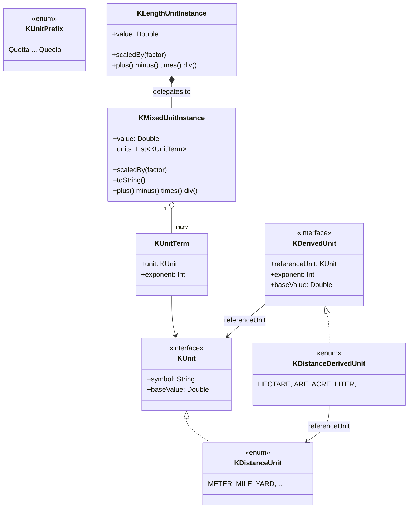

<p align="center">
  
</p>

# kunit

> 🌐 [English](README.md) · [한국어](README.ko.md) · **中文** · [日本語](README.ja.md)
>
> 完整文档也在 [GitHub Pages](https://kleinerhacker.github.io/kunit/) 上以四种语言提供
> ([EN](https://kleinerhacker.github.io/kunit/) ·
> [KO](https://kleinerhacker.github.io/kunit/ko/) ·
> [ZH](https://kleinerhacker.github.io/kunit/zh/) ·
> [JA](https://kleinerhacker.github.io/kunit/ja/))。

用于在 Kotlin(和 Java)中使用不同单位进行计算的 Kotlin 单位框架 —— 用 `Double` 精度以真实物理单位计算,而非
裸数值。

## 检出与构建

```bash
git clone <repository-url>
cd kunit
```

本项目使用 Gradle(包装器已包含在仓库中,无需本地安装 Gradle):

```bash
# 构建
./gradlew build          # Windows: gradlew.bat build

# 仅运行测试
./gradlew test            # Windows: gradlew.bat test
```

需要一个能够解析工具链 25 的 JDK(如有需要,`foojay-resolver` 插件会自动下载)。

## 文档站点

📖 **[在 GitHub Pages 上阅读文档](https://kleinerhacker.github.io/kunit/)**

完整文档(概述、快速开始、混合单位、添加自定义单位、预定义单位)使用
[MkDocs Material](https://squidfunk.github.io/mkdocs-material/) 构建,并通过
[mkdocs-static-i18n](https://github.com/ultrabug/mkdocs-static-i18n) 以英语、韩语、中文和日语提供,带有
明暗模式切换。

```bash
pip install -r docs/requirements.txt

# 本地实时重载服务
mkdocs serve

# 将静态站点构建到 ./site
mkdocs build
```

## 架构

* **`KMixedUnitInstance`** —— 表示一个*混合单位*: 一个归一化的 `Double` 基础值加上一组 `KUnit`,每个都与一个
  指数(正 = 分子,负 = 分母)结合,并被视为相互相乘。
* **`KUnit`** —— 单个"纯"单位的接口(符号 + 到其组基本单位的转换系数)。按单位组实现为
  `enum class ... : KUnit`(例如 `KDistanceUnit`)。
* **包装器类**(例如 `KLengthUnitInstance`)—— 为具体的组通过委托封装一个 `KMixedUnitInstance`,并始终将其值
  归一化为该组的基本单位。它们不局限于指数 1 —— 也涵盖同组的派生量(例如面积 = 长度²,体积 = 长度³)。
* **`of` / `into`** —— 单位的两个动词。用 `number of <值 1 单位模板>`(`10.5 of kilo.meters`)构建,用
  `value into <单位>`(`v into kilo.meters`,返回 `Double`)读取。
* **`KUnitPrefix` 和前缀构建器** —— 完整的 SI 前缀表(Quetta/Q 到 Quecto/q)以**构建器值**(`kilo`、`milli`
  等)暴露,通过属性访问将裸令牌变成值 1 模板(`kilo.meters`、`milli.seconds`)。编译时层次结构
  (`KPrefixBuilder`/`KDiminishingPrefixBuilder`/`KAugmentingPrefixBuilder`)强制哪些单位接受哪些前缀
  (`milli.bytes` 无法编译)。
* **特殊单位** —— 命名的值 1 实例(例如面积的 `hectares`、体积的 `liters`),与任何其他令牌一样与 `of`/`into`
  一起使用。



### 包结构

* 根包 `org.pcsoft.framework.kunit` 包含基础类型 `KUnit`、`KMixedUnitInstance`、`KUnitMeasurable`(含
  `of`/`into`/`scaledBy`)、`KUnitPrefix` 以及 `KPrefixBuilder` 层次结构。
* 每个"纯"单位组拥有自己的子包(例如 `org.pcsoft.framework.kunit.distance`),带有自己的 `KXxxUnit`、
  `KXxxUnitInstance`、其值 1 裸令牌(`K*UnitBareValues.kt`)以及其前缀构建器属性扩展(`K*UnitExtensions.kt`)。

### 运算符

* `+`、`-`、`*`、`/` 对纯单位、混合单位以及二者混合都受支持。
* `==`、`!=`、`<`、`<=`、`>`、`>=` 对纯单位受支持;混合单位额外提供一个用于纯单位/指数检查的方法
  (`hasSameUnits`)。
* `+`/`-` 只在同一单位组且相同指数(纯单位)时,或具有完全相同的 `KUnit`(包括指数,混合单位)时才被允许 ——
  否则会抛出 `IllegalStateException`。

## 框架目前支持什么?

当前实现状态(详见 [STATUS.md](STATUS.md)):

### 根引擎

* 具有完整运算符和基本单位 `toString` 的 `KMixedUnitInstance`/`KUnitTerm` 混合单位引擎
* `of` / `into` 构建 & 读取动词(`Number.of`、`KUnitMeasurable.into`、`scaledBy`)
* 以前缀**构建器**(`kilo`、`milli` 等)暴露的完整 SI 前缀表(24 个值),外加二进制 IEC 构建器(`kibi` 等);
  `KPrefixBuilder` 层次结构在编译时强制执行每单位的前缀策略
* 作为命名值 1 实例的特殊/派生单位(`hectares`、`liters` 等)

### 单位组

| 组 | 子包 | 基本单位 |
|---|---|---|
| 距离 | `org.pcsoft.framework.kunit.distance` | 米 (`KDistanceUnit.BASE`) |
| 时间 | `org.pcsoft.framework.kunit.time` | 秒 (`KTimeUnit.BASE`) |
| 存储 | `org.pcsoft.framework.kunit.storage` | 字节 (`KStorageUnit.BASE`) |
| 速度 (构造: 长度·时间⁻¹) | `org.pcsoft.framework.kunit.speed` | 米每秒 (`KSpeedUnit.BASE`) |
| 数据传输率 (构造: 存储·时间⁻¹) | `org.pcsoft.framework.kunit.datarate` | 字节每秒 (`KDataRateUnit.BASE`) |

#### 距离 (`KDistanceUnit`)

米、英里、海里、码、英尺、英寸、英寻、链、弗隆、天文单位、光秒 … 光年、秒差距。

#### 带维度的子类型(指数作为类型)

距离组在开放基类 `KDistanceUnitInstance`(任意指数)下将指数建模为各自的编译时安全类型:

* **`KLengthUnitInstance`** —— 指数 1(长度): `5 of meters`、`3 of kilo.meters`
* **`KAreaUnitInstance`** —— 指数 2(面积): `(2 of meters) pow 2`、`(2 of kilo.meters) pow 2`,以及命名特殊
  单位 `ares`、`hectares`、`acres`
* **`KVolumeUnitInstance`** —— 指数 3(体积): `(2 of meters) pow 3`,以及 `liters`、`usGallons`、
  `imperialGallons`、`usFluidOunces`、`oilBarrels`

`*`/`/` 尽可能留在这个家族内(`length * length = area`,`area / length = length`);结果指数在 `{1,2,3}` 之外时
回退到 `KDistanceUnitInstance`。跨维度的 `+`/`-`/比较(`length + area`)是**编译错误**,而非运行时失败。

用中缀 `pow` 将单位求幂(Kotlin 没有可重载的 `^`): `(2 of meters) pow 2` 是 `(2 m)² = 4 m²`,
`(2 of meters) pow 3` 是体积,`pow` 在每个组上都有效(`(2 of hours) pow 2`)。这是唯一的求幂语法 —— 没有
`squareXxx`/`cubicXxx` 构造函数。

#### 构造组(由两个核心组合成)

* **速度** (`KSpeedUnit`) —— `length · time⁻¹`;用 `(100 of meters) / (10 of seconds)` 或
  `10 of kilo.meters / hours`(一个 `KSpeedUnitInstance`)直接构建,用 `speed * time` / `length / speed` 恢复
  核心单位。
* **数据传输率** (`KDataRateUnit`) —— `storage · time⁻¹`;用 `(100 of bytes) / (10 of seconds)` 或
  `5 of mega.bytes / seconds`(一个 `KDataRateUnitInstance`)构建,用 `rate * time` / `storage / rate` 恢复
  核心单位。只作为表达式构建(没有 `bytesPerSecond` 令牌);二进制分子通过 `kibi.bytes / seconds`。

### 仍待完成

* 遵循 `length` 模式的更多单位组(例如质量、温度)
* 本身由混合单位组成的复合"纯"单位(例如牛顿)

## 快速开始

将模块添加为依赖(或作为项目/源集包含),并导入你需要的单位组的词汇。

### 距离

```kotlin
import org.pcsoft.framework.kunit.of
import org.pcsoft.framework.kunit.into
import org.pcsoft.framework.kunit.kilo
import org.pcsoft.framework.kunit.distance.*

// 在值 1 模板上用 `of` 构建纯长度值
val distance = 5 of meters           // KLengthUnitInstance(指数 1)
val trip = 10 of miles

// 运算符: 同一组和指数内的自动转换
val total = distance + trip          // KLengthUnitInstance, 归一化为米
val diff = trip - distance

// distance + ((3 of meters) pow 2)   // 无法编译: 长度 + 面积是编译错误

// 比较
val isFarther = trip > distance      // true

// 用 `into` 以特定单位读取值
println(total into kilo.meters)      // 例如 21.0467...
println(total into yards)            // 例如 23018.4...

// 相乘两个长度产生强类型的面积;面积 / 长度再次产生长度
val area = (200 of meters) * (50 of meters)  // KAreaUnitInstance(10 000 m²)
val side = area / (100 of meters)            // KLengthUnitInstance(100 m)

// 通过 `pow` 求幂,以及命名的面积/体积单位
val hall = (3 of meters) pow 2       // KAreaUnitInstance(9 m²)
val bigPlot = (2 of kilo.meters) pow 2 // KAreaUnitInstance(4 000 000 m²)
val box = (2 of meters) pow 3        // KVolumeUnitInstance(8 m³)
val plot = 3 of hectares             // KAreaUnitInstance
println(plot into ares)              // 300.0
val tank = 200 of liters             // KVolumeUnitInstance
println(tank into usGallons)
```

### SI 前缀

```kotlin
import org.pcsoft.framework.kunit.of
import org.pcsoft.framework.kunit.kilo
import org.pcsoft.framework.kunit.distance.meters

// `5 of kilo.meters` -> KLengthUnitInstance(== 5000 m)
val fiveKm = 5 of kilo.meters
println(fiveKm.value) // 5000.0(归一化为米)
```

### 复合 / 混合单位

```kotlin
import org.pcsoft.framework.kunit.of
import org.pcsoft.framework.kunit.pow
import org.pcsoft.framework.kunit.distance.meters
import org.pcsoft.framework.kunit.milli
import org.pcsoft.framework.kunit.time.seconds

// 从值 1 模板组合单位表达式,并用 `of` 缩放
val accel = 10 of meters / (seconds pow 2)   // KMixedUnitInstance, m·s⁻²
val speed = 10 of kilo.meters / milli.seconds // KSpeedUnitInstance(无括号)
```
